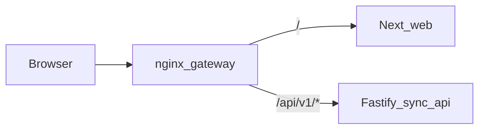

# Single-port web + sync-api (plan of record)

## How to initiate the next build (Phase B)

Do this in **Agent mode** with a single instruction, for example:

> Implement Phase B of `.cursor/plans/single-port-web-sync-api.plan.md`: add Fastify `/api/v1` prefix, switch nginx to `location /api/v1/`, update `NEXT_PUBLIC_NODEX_SYNC_API_URL` / `resolve-sync-base` / e2e / tests.

**Local verification after implementation:**

```bash
# From repo root
npm run test -w @nodex/sync-api
npm run build -w @nodex/web
```

**Docker rebuild (full stack):**

```bash
docker compose build --no-cache nodex-sync-api nodex-web-blue nodex-gateway
docker compose up -d mongo-sync nodex-sync-api nodex-web-blue nodex-gateway
# Or: npm run docker:api:up:detached
```

**Production-style UI deploy (existing flow):**

```bash
npm run deploy
# or web only: npm run deploy:web-only
```

---

## Phase A — completed (already in the repo)

- **Default `docker-compose.yml`**: `mongo-sync`, `nodex-sync-api`, `nodex-web-blue`, `nodex-gateway` start without **legacy `nodex-api` (:3847)**.
- **Legacy API**: `docker compose --profile legacy up -d nodex-api` when needed.
- **`deploy/nginx-gateway.conf`**: proxies **`/health`** and regex **`^/(auth|sync|wpn|me|plugins|public)`** to **`nodex-sync-api:4010`** (Fastify routes are still **without** `/api/v1` until Phase B).
- **`Dockerfile.web` / compose**: `NEXT_PUBLIC_NODEX_SYNC_API_URL` default **`http://127.0.0.1:8080`** (same origin as gateway), sync-only WPN flags.

---

## Phase B — remaining (to match original “single `/api/v1` namespace” goal)

### 1. Fastify (`apps/nodex-sync-api`)

- After CORS on the root app, **`register` a scoped instance** with **`prefix: '/api/v1'`** and call **`registerRoutes`** on that instance so all routes become `/api/v1/auth/...`, `/api/v1/wpn/...`, etc.
- **Health**: either **`GET /api/v1/health`** only (update Docker healthcheck in `docker-compose.yml`) or keep **`GET /health`** on root for probes — pick one and document in **`apps/nodex-sync-api/.env.example`**.

### 2. Nginx

- **`deploy/nginx-gateway.conf`** and **`deploy/nginx-gateway.host.conf`**: replace path-family regex with:

  - `location /api/v1/ { proxy_pass http://nodex_sync_api/api/v1/; ... }` (Docker DNS name vs `127.0.0.1:4010` on host).

- If health stays at root only, add **`location = /health`** → upstream `/health` as today.

### 3. Web + platform

- Set **`NEXT_PUBLIC_NODEX_SYNC_API_URL`** to **`http(s)://<public-host>/api/v1`** (no trailing slash).
- **`packages/nodex-platform/src/resolve-sync-base.ts`**: dev fallback **`http://127.0.0.1:4010/api/v1`** when Phase B lands.
- **`Dockerfile.web`** default for Docker: e.g. **`http://127.0.0.1:8080/api/v1`** if the browser hits the gateway (align with `NODEX_GATEWAY_PORT`).
- **`docker-compose.yml`** build args for `NEXT_PUBLIC_NODEX_SYNC_API_URL` accordingly.

### 4. Tests & scripts

- **`apps/nodex-sync-api/src/integration-auth-wpn.test.ts`**: paths under **`/api/v1`**.
- **`scripts/e2e-run-web.sh`**: sync URL + health wait URL.
- Grep **`/auth/`**, **`/wpn/`**, **`/health`** in tests hitting sync-api.

### 5. Optional

- **`apps/nodex-web/next.config.mjs`**: rewrites **`/api/v1/:path*`** → sync origin for dev same-origin through Next (see plan notes in git history).

### 6. MongoDB Atlas

- No Phase B code: configure **`MONGODB_URI`** / **`JWT_SECRET`** in **`apps/nodex-sync-api/.env`** (gitignored). Atlas Network Access must allow the host running sync-api.

---

## Verification (after Phase B)

- **`GET /api/v1/health`** (and root `/health` if kept) on sync-api and through gateway **`http://127.0.0.1:8080`** (or your `NODEX_GATEWAY_PORT`).
- Browser: register / sign in + one WPN mutation; Network tab shows requests under **`/api/v1/...`** when using gateway base URL.

---

## Context (unchanged intent)

- Next dev port **3000**; sync-api default **4010** ([`apps/nodex-web/package.json`](../apps/nodex-web/package.json), [`apps/nodex-sync-api/src/server.ts`](../apps/nodex-sync-api/src/server.ts)).
- Client base resolution: [`packages/nodex-platform/src/resolve-sync-base.ts`](../packages/nodex-platform/src/resolve-sync-base.ts), HTTP client [`packages/nodex-platform/src/remote-fetch.ts`](../packages/nodex-platform/src/remote-fetch.ts) (`joinUrl(base, "/auth/...")`).



*(Phase A today: gateway → sync uses path families, not yet `/api/v1` on Fastify.)*
