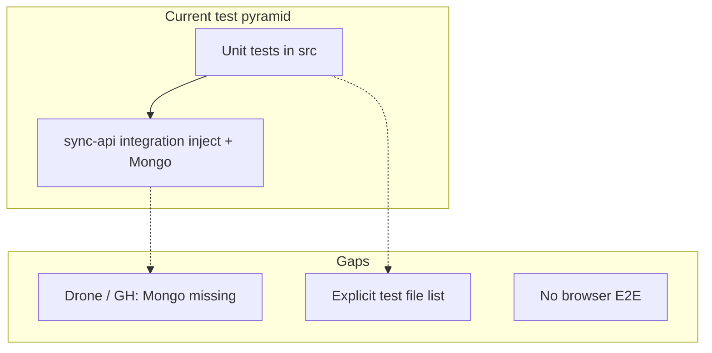

# UI and backend regression testing for Nodex

## Current state (what you already have)

- **Unit / logic tests:** Node’s built-in test runner (`node:test` + `assert`) across [`src/`](src/) (shell URL helpers, MDX trust, VFS paths, sidebar utils, etc.). This is a good **fast baseline** and already acts as documentation for edge cases.
- **Backend integration:** [`apps/nodex-sync-api/src/integration-auth-wpn.test.ts`](apps/nodex-sync-api/src/integration-auth-wpn.test.ts) exercises a **real HTTP surface** (Fastify `inject`): register → JWT → shell layout → WPN note → built-in markdown render. It **skips** when Mongo is unreachable (`serverSelectionTimeoutMS=2500`).
- **CI today:** [`.drone.yml`](.drone.yml) runs `npm run lint` and `npm run test`, but **no Mongo service**—so the integration test almost certainly **never runs in Drone**, only local/docker setups. [`.github/workflows/`](.github/workflows/) has **release-only** workflows; there is **no PR CI** on GitHub unless you use Drone.
- **Root `npm test`:** [package.json](package.json) lists every `*.test.ts` explicitly and runs one file via `tsx --test`; easy to **forget a new file** when adding features.

## Inventory: features, components, and behaviors to test

This section is the **living checklist** of what Nodex does today and what tests should eventually cover (unit, API integration, or web E2E). Paths are from the repo root (`nodex/`).

### Already covered by automated tests

| Area | Test file(s) | Behaviors asserted |
|------|----------------|-------------------|
| Main / IPC | `src/main/parse-asset-ipc-payload.test.ts` | Asset IPC payload parsing (string/object, invalid input) |
| VFS / links | `src/shared/note-vfs-path.test.ts`, `src/shared/note-vfs-link-rewrite.test.ts` | Canonical paths; markdown link rewrite on note title change |
| Sidebar | `src/renderer/notes-sidebar/notes-sidebar-utils.test.ts` | Note tree / sidebar helpers |
| Shell / URLs | `src/renderer/shell/shellTabUrlSync.test.ts`, `src/renderer/shell/shellWelcomeUrlRoutes.test.ts` | Ephemeral tab id parsing; welcome URL routing |
| Documentation plugin | `src/renderer/shell/first-party/plugins/documentation/documentationShellHash.test.ts` | Shell hash behavior for docs |
| Markdown / MDX | `src/renderer/utils/note-mdx-format.test.ts`, `src/renderer/utils/remark-nodex-mdx-trust.test.ts`, `src/renderer/shell/first-party/plugins/markdown/markdownWikiLinkTrigger.test.ts` | MDX trust; wiki-link triggers; format rules |
| Note types | `src/renderer/utils/note-type-initials.test.ts` | Type initials logic |
| Embeds | `src/renderer/components/renderers/observable-embed.test.ts` | Observable embed URL building and validation |
| Scratch / WPN | `src/renderer/wpnscratch/merge-legacy-main-scratch-wpn.test.ts` | Legacy scratch WPN merge |
| Sync API | `apps/nodex-sync-api/src/integration-auth-wpn.test.ts` | Register → JWT → shell layout GET/PUT → workspace → project → root note → builtin plugin meta + render |
| Sync API | `apps/nodex-sync-api/src/marked-smoke.test.ts`, `apps/nodex-sync-api/src/repo-bundled-docs-path.test.ts` | Marked smoke; bundled docs path |

### Product features developed (high level)

1. **Desktop Electron app** — Open a project folder; notes and assets on disk; plugin boundary.
2. **Web app (`@nodex/web`)** — Same `App` shell in Next; cloud/sync paths.
3. **Notes tree and editors** — Multiple note types; markdown/MDX/code/text/JS notebook; plugin-provided editors.
4. **Plugin system** — Manifest validation, JSX compile, React bridge into sandboxed iframes, Plugin IDE, Plugin Manager, marketplace-related UI.
5. **Shell / workbench** — Command palette, mode line, minibuffer, REPL overlay, global context menu, layout persistence, first-party shell plugins.
6. **Auth** — Entry/auth screens; Electron vs web; scratch sessions; sync auth panel.
7. **Cloud / WPN** — Mongo-backed sync-api; workspace/project/note HTTP surface; per-user shell layout; assets; builtin plugin render endpoints.
8. **Documentation hub** — Bundled docs, search, TOC, settings, internal links.
9. **Cloud sync runtime** — RxDB / cloud notes hydration (web and Electron scratch paths).
10. **Security / sandbox** — SES lockdown at app init; secure plugin rendering.

### Backend (`apps/nodex-sync-api`) — contract behaviors

**Auth**

- `POST /auth/register` — Body validation; duplicate email → 409; access + refresh tokens; user persisted.
- `POST /auth/login` — Credentials; 401 on failure; refresh `jti` rotation.
- `POST /auth/refresh` — Refresh validation; reject revoked/invalid; new token pair.
- `GET /auth/me` — JWT required; user id + email.

**Legacy / parallel sync model**

- `POST /sync/push` — Batch note upserts; conflict detection via `updatedAt`.
- `GET /sync/pull` — Notes changed since `since`.

**WPN (workspaces / projects / notes)** — `wpn-routes`, `wpn-write-routes`, `wpn-batch-routes` (integration test today only exercises: create workspace → project → root markdown note).

- List/create/update/delete **workspaces** and **projects** (and ordering where `sort_index` applies).
- List notes per project (**flat preorder**); `GET /wpn/all-notes-list`; `GET /wpn/notes-with-context`.
- **Create note** with `relation` `root` | `child` | `sibling` and optional `anchorId`; validation and error responses.
- **Patch note** (title, content, type, metadata); soft delete / batch operations as exposed by routes.
- **Explorer state** (e.g. expanded ids) if routed.
- **403/404** when resources do not belong to the authenticated user.

**Per-user UI / assets / plugins**

- `GET` / `PUT` `/me/shell-layout` (covered in integration test: null → put → get).
- `me-assets-routes` — Uploads / signed URLs / paths used by web.
- `builtin-plugin-routes` — `builtin-renderer-meta`, `builtin-render` (integration test: markdown).
- `bundled-docs-routes` — Public bundled documentation HTTP surface.

**Ops**

- `GET /health` — Liveness (for CI/E2E waits).

### UI / renderer (`src/renderer/`) — component groups to test

Grouped by subsystem (each maps to many `.tsx` files).

| Subsystem | Representative modules | Behaviors to lock in |
|-----------|------------------------|----------------------|
| App bootstrap | `App.tsx`, `shell/sandbox/sesLockdown` | SES lockdown; provider order; scratch hydrators only when platform/session match |
| Auth | `auth/AuthContext`, `AuthGate`, `EntryScreen`, `AuthScreen`, `ElectronSyncAuthPanel`, `ElectronHomeChromeBar`, `ElectronRunModeGreet` | Guest vs signed-in; web vs Electron entry; missing sync-api URL messaging |
| Workbench chrome | `ChromeOnlyWorkbench`, `PrimarySidebarShell`, `app/AppShellMainColumn`, `app/AppShellBody` | Layout regions; sidebar vs editor; visibility |
| Shell layout | `shell/layout/ShellLayoutContext`, plugin layout hooks | Persisted toggles (mode line, mini bar, etc.) |
| Command / navigation | `NodexCommandPalette`, `NodexMiniBar`, `NodexModeLineHost`, `NodexReplOverlay` | Palette open; commands; mode line / minibuffer |
| Tabs / views | `ShellViewHost`, `ShellViewRegistry`, `EditorTabSidebar`, `ShellActiveTabContext` | Tab open/close; view routing; contributions |
| Notes sidebar | `NotesSidebarPanel*`, rename modal, context menus, pick type | Tree; create/rename/delete; type picker |
| Note editing / viewing | `NoteViewer`, `NoteTypeReactRenderer`, `MarkdownRenderer`, `MdxRenderer`, markdown/JS notebook editors | Editor selection by type; MDX compile errors |
| MDX embeds | `mdx-embed-components`, `mdx-shell-context`, `nodex-mdx-facades` | Embeds; doc links; callouts; Observable policy |
| Documentation plugin | `DocumentationHubView`, search, TOC, settings, link context menu | Hub open; hash routes; navigation |
| WPN / cloud UI | `WpnExplorerPanelView`, `NotesExplorerMainShellView`, `CloudSyncSidebarView`, `CloudSyncMainView` | WPN navigation; cloud sync entry |
| Plugin IDE | `PluginIDE*`, `usePluginIDE.*` | Open project; edit; bundle; npm; tab lifecycle |
| Plugin manager | `PluginManager*`, `WebHeadlessApiMarketplaceSection` | List/install/diagnostics |
| Assets | `AssetPreview`, `PdfAssetPreview`, `ProjectAssetsInline`, `AssetsSidebarSection` | Previews; asset sidebar |
| Settings / theme | `SettingsView`, `ThemeContext`, `ToastContext`, `dialog/NodexDialogProvider` | Settings; toasts; dialogs |
| Debug | `MainDebugDock*` | Dev surfaces (lower regression priority unless relied on) |

**Core (non-React) — plugin pipeline**

- `src/core/plugin-loader`, `manifest-validator`, `jsx-compiler` — Load, validate, transpile (see `docs/repository/IMPLEMENTATION_PROGRESS.md`).
- `src/shared/react-bridge`, `components/renderers/SecurePluginRenderer` — Iframe + React bridge (often E2E or focused integration).

### `@nodex/web`

- Next hosts shared `App` (`apps/nodex-web/app/page.tsx`, `client-shell.tsx`).
- Client shell wiring; `NEXT_PUBLIC_NODEX_SYNC_API_URL` and related env; same renderer as desktop for cloud paths.

### Coverage gaps (prioritize in E2E + integration)

- Most **React** flows are manual or untested end-to-end.
- **Full WPN HTTP matrix**, **refresh token**, **sync push/pull**, **assets routes**, **Plugin IDE/Manager**, and **sandboxed plugins** need narrow integration or E2E beyond today’s single `integration-auth-wpn` story.

## Recommended process (avoid regressions + less rework)

Use a **three-layer** model; each layer catches different failures:

| Layer | Purpose | When to add |
|--------|---------|-------------|
| **Unit** | Pure logic, parsers, URL rules, markdown transforms | Any non-trivial function or regression bug |
| **API integration** | Contracts the UI depends on (auth, layout, WPN CRUD, plugin render) | New/changed routes or payloads |
| **Web E2E (Playwright)** | Full stack: Next UI + real sync-api + Mongo; **feature smoke / critical paths** | User-visible flows; “this must never disappear” |

**Principle:** Prefer **one authoritative E2E** per critical flow (sign-in, open shell, create note) plus **narrow integration tests** for each new endpoint. Do not duplicate the same assertions in three places—E2E proves wiring; integration proves API; unit proves edge cases.

## Implementation plan (aligned with your choice: web-first Playwright)

### 1. Make integration tests run in CI (backend regression)

- **Drone:** Add a **Mongo 7 service** to the `ci` (and `verify-tag`) pipeline and set `MONGODB_URI` (e.g. `mongodb://mongo:27017`—hostname matches Drone’s service name). Keep the existing `npm ci` / `lint` / `test` steps; integration tests should **stop skipping** in CI.
- **GitHub Actions (recommended):** Add a workflow (e.g. [`.github/workflows/ci.yml`](.github/workflows/ci.yml)) on `push` / `pull_request` to `main` with a **`services: mongodb`** block, same env var, then `npm ci`, `npm run lint`, `npm run test`. This covers contributors who do not use Drone.
- **Docs touchpoint:** [docs/deploy-nodex-sync.md](docs/deploy-nodex-sync.md) already mentions CI + Mongo; update the snippet to match the actual Drone/GHA config so the “reference” stays accurate.

### 2. Fix root test discovery (stop losing new tests)

- Replace the long hand-maintained file list in [`package.json`](package.json) `test` script with **directory-based invocation**, e.g. run Node’s test runner against `src` only (workspace `apps/nodex-sync-api` keeps its own `npm run test -w @nodex/sync-api`).
- **Drop the separate `tsx --test` line** for [`src/shared/note-vfs-link-rewrite.test.ts`](src/shared/note-vfs-link-rewrite.test.ts) if `node --experimental-strip-types --test` runs the full tree successfully (verify locally/CI).
- If any file still needs `tsx` (path/loader edge case), isolate that in a tiny second command with a **comment** explaining why—default path should be “one glob / one tree.”

### 3. Add Playwright E2E for `@nodex/web` (UI regression reference)

- **Location:** Add an `e2e/` (or `apps/nodex-web/e2e/`) package with `@playwright/test`, `playwright.config.ts`, and specs under `e2e/tests/` (or `e2e/*.spec.ts`).
- **Local / CI orchestration:**
  - Start **Mongo** (CI service; local: existing `docker compose --profile sync` or a one-liner container).
  - Start **sync-api** in the background with `MONGODB_URI`, `JWT_SECRET` (match [apps/nodex-sync-api](apps/nodex-sync-api) expectations), `PORT=4010`.
  - Build and serve **Next**: `npm run build -w @nodex/web` then `npm run start -w @nodex/web` with `NEXT_PUBLIC_NODEX_SYNC_API_URL=http://127.0.0.1:4010` (see [`packages/nodex-platform/src/resolve-sync-base.ts`](packages/nodex-platform/src/resolve-sync-base.ts)).
  - **Wait for readiness:** poll `GET http://127.0.0.1:4010/health` ([`apps/nodex-sync-api/src/routes.ts`](apps/nodex-sync-api/src/routes.ts)) before opening the browser.
- **First specs (high value, small):**
  - **Smoke:** app loads at `/` without a hard crash (assert on a stable landmark in [`src/renderer/App.tsx`](src/renderer/App.tsx) / shell—pick selectors that are intentional, e.g. `data-testid` only where needed).
  - **Auth + WPN path (optional second PR if heavy):** register/sign-in via UI or `page.request` to API, then assert shell or a post-login element—mirror the story in `integration-auth-wpn.test.ts` so **API integration + E2E** document the same feature two ways.
- **Scripts:** Add `test:e2e` (local) and `test:e2e:ci` (install browsers + run headless). Wire **CI** to run E2E in the same workflow **after** unit tests, or as a **parallel job** if time matters.
- **Playwright `webServer`:** Either a small **shell script** that starts api + next (simpler to reason about) or multi-command tooling; avoid flaky “port already in use” by fixed ports and `reuseExistingServer: !CI`.

### 4. Conventions so suites stay a feature reference

- **Co-locate** unit tests: `foo.ts` + `foo.test.ts` under `src/`.
- **sync-api:** Add new `*.test.ts` files beside routes or under `src/__tests__/`—follow the **`inject` + disposable DB name** pattern in [`integration-auth-wpn.test.ts`](apps/nodex-sync-api/src/integration-auth-wpn.test.ts).
- **E2E:** One spec file per **user journey** (`sign-in-wpn.spec.ts`, `documentation-hub.spec.ts`, …). In PR template or short contributor note, require **“new user-visible flow → E2E or extended integration”** (you choose minimum bar per PR size).

### 5. What we are not doing in this pass (unless you expand scope)

- **Electron window automation** (playwright-electron, etc.)—heavier; web E2E already covers the shared [`src/renderer/App.tsx`](src/renderer/App.tsx) entry used by [`apps/nodex-web/app/page.tsx`](apps/nodex-web/app/page.tsx).
- **Visual regression / Percy**—optional later.
- **React Testing Library**—useful for isolated components; add when a component has complex state and E2E is too slow/flaky—not required for the first regression net.

## Clarifications already answered

- **E2E surface:** Web first (Playwright + Next + sync-api + Mongo).

## Risk notes

- **CI time:** E2E + browser install increases job duration; keep the first suite minimal (smoke + one auth path).
- **Flakes:** Rely on `/health` wait, fixed env, and avoid arbitrary `sleep`; use Playwright `expect` retries where appropriate.
