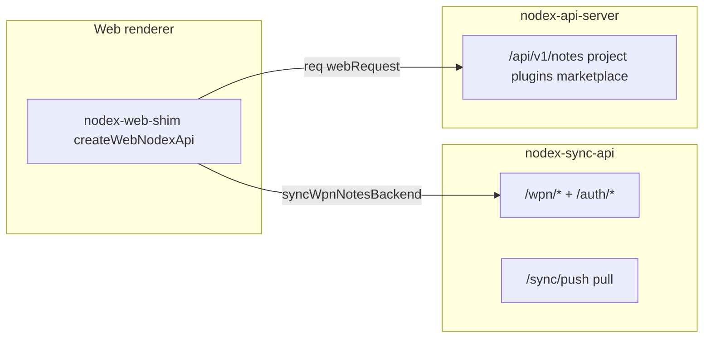

# Sunset headless API; web (and tooling) on sync-api only

## Goals

- **Sunset headless** (`[src/nodex-api-server](src/nodex-api-server)`, `npm run start:api`) as a **second HTTP stack** once **sync-api** covers the same responsibilities — fewer processes, one place to evolve APIs, less mental overhead while developing.
- **Signed-in web** (and any browser path) should use **sync-api + Mongo** only; no `NODEX_PROJECT_ROOT` HTTP server for normal product flows.
- **Source of truth** for multi-user / cloud paths remains **Mongo** via `[apps/nodex-sync-api](apps/nodex-sync-api)` (`[docs/deploy-nodex-sync.md](docs/deploy-nodex-sync.md)`, ADR-017 in `[docs/repository/proposed-architecture.md](docs/repository/proposed-architecture.md)`).
- **Electron local vault** continues to use **main process + IPC** (workspace JSON on disk); that path does **not** depend on headless (see below).

## Non-goals (initial phase)

- Full parity with **Electron-only** IPC (folder pickers, scratch-to-disk, local zip plugin import).
- Dropping headless **before** sync-api (and optional local-Electron adjustments) implement **parity** for every surface still on Express today — sunset is **end state**, not day one.

## Does Electron need headless?

**No — not for the default local “open a folder” vault.** The **Electron main** process loads `[data/nodex-workspace.json](src/core/workspace-store.ts)` and exposes `**window.Nodex` via preload IPC**; there is **no** dependency in `src/main` / `preload` on starting the Express headless server or port `:3847`.

- **Electron + cloud / signed-in:** The renderer uses `**nodex-sync-api`** over HTTP (same as web), not headless (`[docs/deploy-nodex-sync.md](docs/deploy-nodex-sync.md)`).

So **sunsetting headless does not block Electron** for core notes/workspace; it **does** require that anything today **only** implemented on Express (e.g. some plugin render, marketplace HTTP, assets) either moves to **sync-api**, runs **in-process** in Electron main, or is scoped **desktop-only** with a clear stub on web.

## Direction: obsoleting `npm run start:api`

**Target end state:** remove `**npm run start:api`** and the **headless** package from the **supported** dev/prod story after the **sunset-headless** todo (parity + migration of scripts/docs).

**Until parity:** keep headless runnable for developers who still rely on legacy web + `?web=1&api=` or tests that hit `/api/v1/...`.

**Single-tenant on-disk workflows** after sunset: served by **Electron** (local IPC) or by a **deliberate** small tool — not a duplicate full HTTP clone of sync-api unless product still demands headless HTTP for automation (revisit in ADR if needed).

## Current architecture (baseline)

When `**syncWpnNotesBackend()**` is true (`[src/renderer/nodex-web-shim.ts](src/renderer/nodex-web-shim.ts)`: `NEXT_PUBLIC_NODEX_SYNC_API_URL` / `NEXT_PUBLIC_NODEX_WPN_USE_SYNC_API`, etc.), **WPN-shaped note operations** already use `**wpnHttp` → `syncWpnFetch`** to Fastify. Listing avoids falling back to headless JSON WPN when sync is configured.

Remaining **headless-only** surfaces in the same file (via `**req` / `webRequest` / raw `/api/v1` fetch**):

| Surface                       | Headless paths                                      | Notes                                                                 |
| ----------------------------- | --------------------------------------------------- | --------------------------------------------------------------------- |
| Legacy flat notes             | `GET/PATCH/POST /notes/...`                         | Bypass when `syncWpnNotesBackend()`; prod web should not rely on this |
| Plugin render                 | `POST /plugins/render-html`                         | Security-sensitive; needs sync-api or separate worker                 |
| Plugin meta                   | `GET .../plugins/renderer-meta`                     | Same                                                                  |
| Session plugins / marketplace | `/plugins/session-installed`, `/marketplace/`*      | Product decision: web scope                                           |
| Shell layout                  | `GET/POST /project/shell-layout`                    | Candidate for per-user Mongo blob                                     |
| Undo/redo                     | `POST /undo`, `/redo`                               | Client stack vs server                                                |
| Assets                        | various `/api/v1/assets/...` (e.g. stub `assetUrl`) | Align with sync or CDN                                                |

**WPN methods** already go through `**wpnReq` → `wpnHttp`**, which routes to sync when configured.

## Phased implementation

### Phase A — Configuration and explicit modes

- Document a **matrix**: `NEXT_PUBLIC_NODEX_SYNC_API_URL`, `NEXT_PUBLIC_NODEX_WPN_USE_SYNC_API`, `NEXT_PUBLIC_NODEX_API_SAME_ORIGIN`, `__NODEX_WEB_API_BASE__`, `[initHeadlessWebApiBaseFromUrlAndStorage](src/renderer/nodex-web-shim.ts)`.
- Add an explicit `**webBackendMode`** (env or derived): e.g. `sync-only` vs `headless-dev`. In `**sync-only`**, failed sync calls must **not** silently fall back to headless for WPN (already partially enforced for list aggregation).

### Phase B — Shell layout and user prefs (high value, smaller scope)

- **sync-api**: New Mongo collection or field on user doc, e.g. `user_ui` / `shell_layout` JSON + `updated_at`.
- **Routes**: `GET /me/shell-layout`, `PUT /me/shell-layout` (or under `/wpn/...` if you prefer namespacing) with JWT from existing `[requireAuth](apps/nodex-sync-api/src/auth.ts)` pattern.
- **Shim**: When `syncWpnUsesSyncApi()` && resolved sync base, implement `**getShellLayout` / `setShellLayout`** via `syncWpnFetch` instead of `req`.

### Phase C — Undo / redo for web

- **Option C1 (recommended first):** **Renderer-only** undo stacks for note edits (no headless). May diverge from Electron file-backed undo until unified.
- **Option C2:** Server-side stacks in Mongo (userId + projectId) — more work, cross-device semantics.
- Wire `**nodexUndo` / `nodexRedo`** in shim to the chosen implementation when in sync-only web mode.

### Phase D — Plugins and marketplace

- **D1 — Minimal web:** Only **built-in** note types; stub or no-op `**getPluginHTML`** for unknown types with clear UX; keep marketplace install desktop-only until ported.
- **D2 — Full:** Port **render-html**, **renderer-meta**, **session-installed**, **marketplace** from Express to sync-api with **timeouts, allowlists, and sandbox** contract matching current server behavior. Prefer **extracting shared handlers** into a package used by both servers to avoid duplicate security logic.

Decision should be recorded in this plan’s todos before large implementation.

### Phase E — Assets

- Replace dependence on `**/api/v1/assets/file/...`** for web with one of: **sync-api authenticated asset routes**, **object storage + signed URLs**, or **Next.js API routes** proxying to sync-api.
- Update `**assetUrl`** and any fetch sites in `[nodex-web-shim.ts](src/renderer/nodex-web-shim.ts)` / `[createPlainBrowserDevStub](src/renderer/nodex-web-shim.ts)` accordingly.

### Phase F — Bundled documentation (hosted web)

- Today bundled docs seed from **disk** in Node (`[src/core/bundled-docs-seed.ts](src/core/bundled-docs-seed.ts)`) when workspace boots — not automatic for browser-only hosted web.
- Options: **deploy-time seed** into Mongo (Documentation project), **static MD** behind CDN, or **build-time embed**. Align `[fetchBundledDocumentationNote](src/renderer/shell/first-party/plugins/documentation/documentationFetchBundledNote.ts)` / hub loading.

### Phase G — Documentation, Compose, testing

- Update `[docs/deploy-nodex-sync.md](docs/deploy-nodex-sync.md)` with **“web + API dev checklist”** (Mongo + sync-api only; headless deprecated).
- Optional: extend `[docker-compose.yml](docker-compose.yml)` with a documented **web+sync+mongo** profile for local demos (no headless).
- **E2E / integration**: sign-in → WPN CRUD → layout persist → open note with plugin (per D1/D2).

### Phase H — Sunset headless (after parity)

- Delete or archive `src/nodex-api-server` (or trim to a thin compatibility shim only if something external still requires it — time-boxed).
- Remove `npm run start:api` from root/workspace scripts; update README, Docker, CI, and any integration tests that assume `:3847`.
- Strip `**webRequest` / `req` / `__NODEX_WEB_API_BASE__`** paths from `[nodex-web-shim.ts](src/renderer/nodex-web-shim.ts)` once all callers use sync-api.

## Success criteria

- **Dev:** run **Next + `npm run sync-api` + Mongo** only; no `start:api` for normal feature work (`[docs/deploy-nodex-sync.md](docs/deploy-nodex-sync.md)`).
- **Prod web:** signed-in flows need **only** sync-api; no `NODEX_PROJECT_ROOT` HTTP server for product SKUs.
- **Electron:** local vault unchanged (IPC + disk); cloud Electron unchanged (sync-api HTTP).
- **End state (Phase H):** headless removed from docs and default tooling; dual-stack overhead gone.

## References

- `[src/renderer/nodex-web-shim.ts](src/renderer/nodex-web-shim.ts)` — `createWebNodexApi`, `syncWpnUsesSyncApi`, `wpnHttp`, `webRequest`
- `[apps/nodex-sync-api/src/routes.ts](apps/nodex-sync-api/src/routes.ts)` — auth, sync push/pull, WPN registration
- `[docs/deploy-nodex-sync.md](docs/deploy-nodex-sync.md)` — env vars, Compose profile `sync`
- `[docs/repository/proposed-architecture.md](docs/repository/proposed-architecture.md)` — ADR-017, P2 web write path

