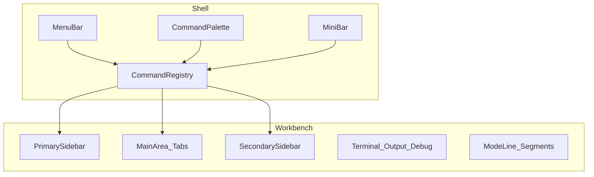
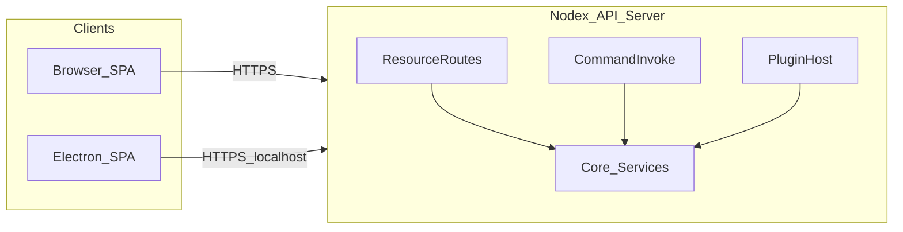

# Detach UI from logic

## Purpose

Nodex should separate **behavior** (commands, plugin APIs, note-type logic) from **presentation** (menus, layout, palette, mode line). The same registered capabilities can drive different shells or skins later; the workbench is VS Code–inspired but not required to match it feature-for-feature.

**Deployment target:** Nodex should be hostable as a **web app** (browser SPA + backend) and as **Electron** without two divergent feature models. The **authoritative core** exposes behavior through an **HTTP API** so the renderer never depends on direct Node or filesystem access for product logic.

## Non-goals (for this note)

- Full parity with the VS Code extension host or Emacs.
- Exact implementation details of React state vs stores (call that out in code as you build it).
- Final keybinding tables (document the *model* below; assign chords separately).
- A full OpenAPI document in this file (reference it elsewhere when it exists).

---

## Workbench regions

Rough layout, mirroring a typical IDE:

| Region | Role |
|--------|------|
| **Menu bar** | Top-level menus and submenus; items can reveal views or run commands. |
| **Primary sidebar** | Optional; can host a file tree, activity views, or panel chrome. Configurable left/right. |
| **Secondary sidebar** | Optional second side strip for “secondary” app or plugin UI. |
| **Panel menu bar** | In-panel toolbar: each panel can expose its own menu items that switch inner views or run commands. |
| **Main / editor area** | Tabbed primary surface (e.g. Plugin IDE, or a note editor). |
| **Below main** | Terminal, output, debug, or other docked strip between sidebars and the bottom of the window. |
| **Mini bar** | Emacs-style input line for command entry and prompts. |
| **Command palette** | Fuzzy list of commands (same registry as the mini bar). |
| **Mode line / status bar** | Bottom context strip; see **Stacked segments** below. |

**Navigation model:** Menu bar entries and panel menu items may **open a view** in a side panel or **run a command**. Multiple contributions can register into the same global shell regions; resolution is by contribution ids and user focus, except where **notes** override that (next section).



---

## Notes UI (note-centric)

This path is **not** “whichever plugin last grabbed the sidebar.”

- For each **note type**, the **primary editor** and the **notes side panel** form a **fixed pair** defined by that type.
- **State** for that pair is scoped to the **active note tab** (the open document). Changing tabs updates primary + side panel context together.

Global shell contributions (Plugin IDE, arbitrary plugin views) are a separate concern from this **note-type bundle**.

---

## Commands: mini bar and command palette

- **Both** surfaces exist: **mini bar** (Emacs-like) and **command palette**.
- They read from a **single command registry**: one **technical command id**, one handler, two (or more) ways to invoke or complete it.
- **Declarative metadata** (title, category, palette visibility, optional menu placement, documentation string) plus **imperative registration** of handlers at runtime (`registerCommand`, activation, dynamic views) — **hybrid** model, similar in spirit to manifest `contributes` + extension code.

When two entries share the same **display** label, the UI adds **disambiguation** (e.g. plugin id, publisher, path — exact fields to refine in product).

**Open detail:** per-command flags for “palette only”, “mini bar only”, and default keybindings.

---

## Identifiers and collisions

- Plugins use **unique** technical ids (`pluginId.commandId`, stable across sessions).
- **Collisions** on human-readable titles are handled in the UI with **extra context**, not by merging distinct commands.

---

## Mode line: stacked segments

The bottom bar is **segmented** (e.g. left / center / right, and optionally more granular slots inside a region).

- Nodex **reserves** segments for core status (cursor, errors, sync, etc.).
- Plugins contribute to **designated segments** (by segment id and ordering rules), not by replacing the entire bar.

**Open detail:** slot names, ordering when multiple plugins share one segment, transient vs pinned items.

---

## Contribution types (catalog)

Examples of things the host merges from Nodex core and plugins:

- **Command** — id, title, handler, docs; appears in palette / mini bar per flags.
- **Menu** / **MenuItem** — placement under menu bar or panel menus; may run a command or reveal a view.
- **View** / **Panel** — optional contribution into a shell region (Plugin IDE and global UI).
- **NoteType** — primary editor + paired notes side panel + per-tab state contract.
- **StatusBarItem** / **ModeLineSegment** — contribution into a specific segment.

---

## Nodex (core) responsibilities

- System behavior: workspace, plugins lifecycle, security boundaries, libraries exposed to plugins.
- Render **host chrome** and merge **plugin contributions** into menus, palette, mini bar, mode line, and note-type registration.
- Examples of core-driven UI: plugin list, note types supplied by core, global menus.
- Core commands are registered in the **same** registry as plugins (with a clear `nodex.*` or similar namespace).

**Example (illustrative):**

```text
id: nodex.plugins.listInstalled
title: Plugins: List installed
handler: (ctx) => { ... }
declaredIn: core manifest + runtime registerCommand
```

---

## Plugin responsibilities

- Expose behavior under **unique** plugin ids; register **commands** and optional **menu items**, **views**, and **mode line segments**.
- Ship **documentation** for commands and features (for palette help, settings, or future docs UI).
- Do **not** assume exclusive ownership of global shell regions except where the API assigns a dedicated segment or view slot.

**Example (illustrative):**

```text
id: tiptap.notes.bold
title: Note: Bold
handler: (ctx) => { ... }
declaredIn: plugin manifest contributes.commands + registerCommand on activate
```

---

## HTTP API, plugins, and hosting (web + Electron)

### Principles

1. **Core speaks HTTP** — Business rules, persistence, and plugin orchestration live in a **backend process** that exposes an API. The SPA (browser or Electron window) is a **client**: it renders UI and calls HTTP (and optional real-time channels below).
2. **Plugin → core via the same API** — In-process helpers for plugins are **wrappers**; anything that mutates state or triggers host behavior should be realizable as an HTTP call (same routes and auth as the first-party client). That keeps Electron and web on one contract.
3. **Two HTTP layers (both required)** — Align with REST where data is naturally resource-shaped, and with **command invoke** where behavior matches the **command registry** (palette / mini bar / menus):
   - **Resource REST** — e.g. notes, workspaces, trees, attachments: `GET`/`POST`/`PATCH`/`DELETE` on stable paths; supports caching, pagination, and clear ownership of persisted state.
   - **Command invoke** — e.g. `POST /api/v1/commands/:commandId/invoke` with a JSON body (context, arguments). Every registered command id should be invokable this way for parity with the desktop shell.
4. **Rules of thumb** — Prefer **resources** for reading and writing **durable state**; prefer **command invoke** for **orchestration**, IDE-style actions, and plugin-defined operations that do not map cleanly to a single resource. Avoid implementing the same semantics twice unless commands are thin facades over resource services.
5. **Electron = same client** — The Electron app uses the **same SPA** and talks to the **same HTTP API**, typically a **local server** on loopback (single packaged process that starts the API and opens the window). Direct IPC may exist later as an **optimization**, not as a second source of truth.

### Real-time and long-running work

Not every interaction must be a synchronous REST response. The backend may also expose **WebSocket** and/or **SSE** for sync, live tree updates, job progress, or push notifications—similar in spirit to Trilium’s internal REST + WebSocket split. Document event types alongside the HTTP surface so clients stay predictable.

### Hosting a web app

| Piece | Role |
|--------|------|
| **Static SPA** | Built renderer assets; served from the same origin as the API (reverse proxy) or from a CDN with **CORS** configured for the API origin. |
| **API server** | Implements resource routes, command invoke, auth middleware, plugin host, and data access. |
| **Reverse proxy** (optional) | TLS termination, `/` → static, `/api` → Node (or equivalent). |

**Auth (to specify in implementation):** sessions (HTTP-only cookies), bearer tokens, or both; all mutating resource routes and command invoke must enforce **authorization** per user/tenant. Optionally add a **separate external API** (token-scoped, narrow surface) for automation—analogous to Trilium ETAPI—if third-party integrations need a stable contract.

### Where plugins run (web-safe default)

- **Default:** Plugins execute **on the server** inside a **controlled host** (sandbox policy TBD: worker, subprocess, or restricted VM). They register commands and handlers that the server exposes through the same HTTP API. The browser does not run arbitrary plugin code with full system access.
- **Browser-delivered plugins** (if ever supported) are a **higher-risk** mode and should only call Nodex through **documented HTTP APIs**, not ad hoc network or storage—unless the product explicitly accepts that trust model.

### Diagram (client → API)



---

## Lifecycle, persistence, trust (outline)

These deserve follow-up sections as the implementation lands:

- **Lifecycle** — on plugin unload: unregister commands, views, and status items; close or hand off tabs as needed.
- **Persistence** — sidebar sizes, last-open views, palette history (if any).
- **Trust** — which code runs in the **browser/Electron renderer** (untrusted UI) vs **API server**; plugins on the server receive only capabilities the host exposes; filesystem and network access are mediated by core, not by raw plugin imports in the client.

---

## Relation to current code

Refactors that split a large component into smaller hooks or modules (for example under `src/renderer/plugin-ide/`) improve maintainability and align with “thin UI, fat registry” in spirit. The **contribution registry** and **segmented shell** described here are the direction for a platform-wide API; they can grow alongside incremental extractions from existing screens.

Migrating to **web + HTTP everywhere** means introducing (or hardening) a **long-lived API server** and gradually routing renderer operations through **fetch** (resources + command invoke) instead of Electron-only or direct `ipcRenderer` paths for product logic. The command registry on the client can stay driven by metadata fetched from the server where needed.
