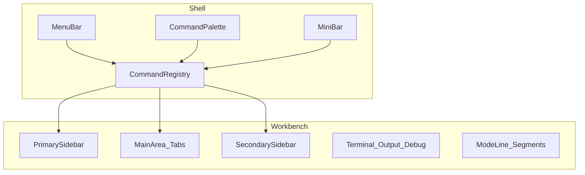
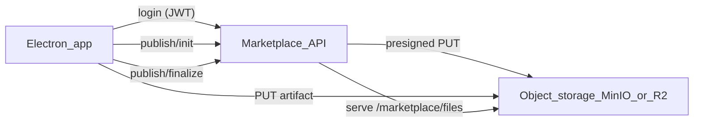
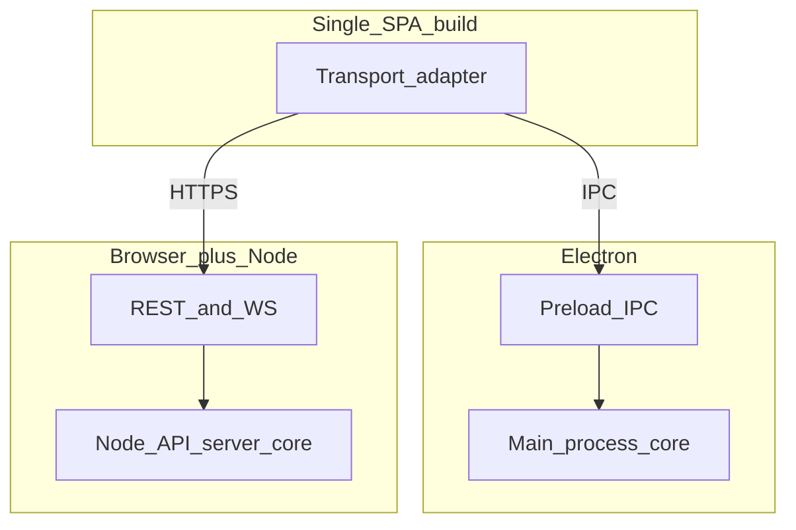

# Detach UI from logic

## Purpose

Nodex should separate **behavior** (commands, plugin APIs, note-type logic) from **presentation** (menus, layout, palette, mode line). The same registered capabilities can drive different shells or skins later; the workbench is VS Code–inspired but not required to match it feature-for-feature.

**Deployment target:** One **UI codebase** (the same React SPA) must run in two ways: **inside Electron** (UI ↔ core via **IPC** through preload) and **in a normal browser** against a **standalone Node server** (UI ↔ core via **REST**, per [nodex-openapi.yaml](../api/nodex-openapi.yaml)). Feature parity is the goal: the same product behavior, with **transport chosen by host** (IPC vs HTTP), not two unrelated apps.

## Non-goals (for this note)

- Full parity with the VS Code extension host or Emacs.
- Exact implementation details of React state vs stores (call that out in code as you build it).
- Final keybinding tables (document the *model* below; assign chords separately).
- A full OpenAPI document in this file (reference it elsewhere when it exists).

**API contract (machine-readable):** [nodex-openapi.yaml](../api/nodex-openapi.yaml) — resource examples (`/notes`), command discovery (`GET /commands/registry`), and invoke (`POST /commands/{commandId}/invoke`). Extend this file as routes ship; keep it the single catalog for tools and integrators.

**Modular plugins (no iframes, SES, React shell slots):** [modular-plugins-architecture.md](./modular-plugins-architecture.md).

---

## Workbench regions

Rough layout, mirroring a typical IDE:

| Region | Role |
|--------|------|
| **Menu bar** | Top-level menus and submenus; items can reveal views or run commands. |
| **Primary sidebar** | Optional; can host a file tree, activity views, or panel chrome. Configurable left/right. |
| **Secondary sidebar** | Optional second side strip for “secondary” app or plugin UI. |
| **Panel menu bar** | In-panel toolbar: each panel can expose its own menu items that switch inner views or run commands. |
| **Main / editor area** | Tabbed primary surface (e.g. Plugin IDE, or a note editor). |
| **Below main** | Terminal, output, debug, or other docked strip between sidebars and the bottom of the window. |
| **Mini bar** | Emacs-style input line for command entry and prompts. |
| **Command palette** | Fuzzy list of commands (same registry as the mini bar). |
| **Mode line / status bar** | Bottom context strip; see **Stacked segments** below. |

**Navigation model:** Menu bar entries and panel menu items may **open a view** in a side panel or **run a command**. Multiple contributions can register into the same global shell regions; resolution is by contribution ids and user focus, except where **notes** override that (next section).



---

## Notes UI (note-centric)

This path is **not** “whichever plugin last grabbed the sidebar.”

- For each **note type**, the **primary editor** and the **notes side panel** form a **fixed pair** defined by that type.
- **State** for that pair is scoped to the **active note tab** (the open document). Changing tabs updates primary + side panel context together.

Global shell contributions (Plugin IDE, arbitrary plugin views) are a separate concern from this **note-type bundle**.

---

## Commands: mini bar and command palette

- **Both** surfaces exist: **mini bar** (Emacs-like) and **command palette**.
- They read from a **single command registry**: one **technical command id**, one handler, two (or more) ways to invoke or complete it.
- **Declarative metadata** (title, category, palette visibility, optional menu placement, documentation string) plus **imperative registration** of handlers at runtime (`registerCommand`, activation, dynamic views) — **hybrid** model, similar in spirit to manifest `contributes` + extension code.

When two entries share the same **display** label, the UI adds **disambiguation** (e.g. plugin id, publisher, path — exact fields to refine in product).

### Keybindings and surface visibility

- **Defaults:** Global chords live in a **keymap** table (separate from this architecture note). The registry may ship **suggested** keybindings per command; the user keymap overrides them.
- **Per-command flags** (declarative metadata, mirrored in [nodex-openapi.yaml](../api/nodex-openapi.yaml) `CommandDescriptor` where applicable):
  - **`palette`** — include in command palette (default `true`).
  - **`miniBar`** — invokable / completable from the mini bar (default `true`).
  - Either flag may be `false` to hide a command from that surface (e.g. internal or dangerous actions palette-only).
- **Resolution order:** user keymap → command default → unbound. Conflicts surface in settings or via “steal binding” UX (product detail).

---

## Identifiers and collisions

- Plugins use **unique** technical ids (`pluginId.commandId`, stable across sessions).
- **Collisions** on human-readable titles are handled in the UI with **extra context**, not by merging distinct commands.

---

## Mode line: stacked segments

The bottom bar is **segmented**. Reserved **segment ids** (host-owned unless noted):

| Segment id | Owner | Typical content |
|------------|--------|-----------------|
| `host.left` | Nodex | Branch / workspace / context label |
| `host.center` | Nodex | Primary message, progress, inline errors |
| `host.right` | Nodex | Cursor / selection, encoding, sync tick |
| `plugin.primary` | Plugins (shared) | One **primary** plugin line per context; ordered list |
| `plugin.secondary` | Plugins (shared) | Lower-priority hints, badges |

**Ordering within a segment**

- **Host segments** — single writer each (`host.*`).
- **`plugin.primary` / `plugin.secondary`** — each contribution has **`priority`** (number, higher first). Tie-break: **plugin id** lexicographic, then **contribution id**.
- Multiple items may be **collapsed** into a menu or truncated with “…” if width is exceeded (UI detail).

**Transient vs pinned**

- **Pinned** — registered mode-line items that stay until unregistered (default for plugin status).
- **Transient** — optional TTL or explicit dismiss; host may use transient for toast-like status in `host.center` without polluting pinned state.

---

## Contribution types (catalog)

Examples of things the host merges from Nodex core and plugins:

- **Command** — id, title, handler, docs; appears in palette / mini bar per flags.
- **Menu** / **MenuItem** — placement under menu bar or panel menus; may run a command or reveal a view.
- **View** / **Panel** — optional contribution into a shell region (Plugin IDE and global UI).
- **NoteType** — primary editor + paired notes side panel + per-tab state contract.
- **StatusBarItem** / **ModeLineSegment** — contribution into a specific segment.

---

## Nodex (core) responsibilities

- System behavior: workspace, plugins lifecycle, security boundaries, libraries exposed to plugins.
- Render **host chrome** and merge **plugin contributions** into menus, palette, mini bar, mode line, and note-type registration.
- Examples of core-driven UI: plugin list, note types supplied by core, global menus.
- Core commands are registered in the **same** registry as plugins (with a clear `nodex.*` or similar namespace).

**Example (illustrative):**

```text
id: nodex.plugins.listInstalled
title: Plugins: List installed
handler: (ctx) => { ... }
declaredIn: core manifest + runtime registerCommand
```

---

## Plugin responsibilities

- Expose behavior under **unique** plugin ids; register **commands** and optional **menu items**, **views**, and **mode line segments**.
- Ship **documentation** for commands and features (for palette help, settings, or future docs UI).
- Do **not** assume exclusive ownership of global shell regions except where the API assigns a dedicated segment or view slot.

**Example (illustrative):**

```text
id: tiptap.notes.bold
title: Note: Bold
handler: (ctx) => { ... }
declaredIn: plugin manifest contributes.commands + registerCommand on activate
```

---

## Dual hosts: Electron (IPC) and Node server (REST)

### Single UI base

- One **renderer build** (React SPA). The app detects the host (e.g. **`window.Nodex`** from preload vs plain browser) and uses a **transport adapter**: **IPC** in Electron, **`fetch`** (REST + optional WebSocket/SSE) against a configured **API base URL** in the browser.
- **No duplicate product UI** — only duplicate *entrypoints*: `electron .` vs `node server` + open `https://host/`.

### Electron (desktop)

- The **renderer** talks to **core** through **preload / IPC** (`window.Nodex`, `ipcRenderer.invoke`, etc.) — the model the codebase uses today.
- **Main process** owns persistence, native dialogs, filesystem, and plugin loading; business rules live there (or in modules shared with the server — implementation detail).

### Standalone Node + browser (web)

- A **long-lived Node process** exposes the **HTTP API** ([nodex-openapi.yaml](../api/nodex-openapi.yaml)): resources + command invoke + auth + plugin host on the server.
- The **browser** loads the same SPA; the adapter calls **REST** (and optional real-time channels) instead of IPC. The renderer must not rely on Electron-only globals in this mode.

### Keeping contracts aligned

- **Semantic parity:** IPC handlers in **main** and **HTTP routes** on the **Node server** should implement the **same operations** (notes, plugins, commands). Prefer a **shared service layer** both call into, so behavior does not drift.
- **Plugin → core:** In Electron, plugins use host libraries mediated by main; in web, plugins run **server-side** (default) and expose behavior through REST the same way the first-party client would call it.
- **OpenAPI** documents the **web** surface; IPC can be tracked with a parallel channel list or generated stubs — detail TBD.

### REST shape (web server)

Two HTTP layers on the server (both required for full parity with in-app commands):

1. **Resource REST** — notes, workspaces, trees, attachments: `GET`/`POST`/`PATCH`/`DELETE` on stable paths.
2. **Command invoke** — e.g. `POST /api/v1/commands/:commandId/invoke` for registry-aligned actions (palette / mini bar / automation).

**Rules of thumb:** Prefer **resources** for durable state; prefer **command invoke** for orchestration and IDE-style actions. Commands may be thin facades over the same services used by resource handlers.

### Real-time (web)

Not every interaction must be synchronous REST. The **Node server** may expose **WebSocket** and/or **SSE** for sync, live tree updates, or job progress. Document event types next to the HTTP surface.

### Hosting the web stack

| Piece | Role |
|--------|------|
| **Static SPA** | Built renderer assets; same origin as API or CDN + **CORS** to API. |
| **API server** | Resource routes, command invoke, auth, plugin host, data access. |
| **Reverse proxy** (optional) | TLS, `/` → static, `/api` → Node. |

**Auth:** sessions, bearer tokens, or both; authorize every mutating route and command invoke. Optional narrow **external API** (ETAPI-style) for integrations.

**Service split guidance (optimize for parity + simplicity):**

- **Start simple:** one **API service** that serves the REST surface plus marketplace endpoints (metadata + static files), one **web frontend** (static export or Next server), and an optional reverse proxy to expose a single origin.
- **Split marketplace later** only if you need an independent scaling/security boundary. Most “marketplace assets” scale best as **object storage + CDN**, not a dedicated microservice.

### Reference deployment matrix (web + Electron treated equally)

| Mode | UI | Transport | API runtime | Source_of_truth | Notes |
|------|----|-----------|-------------|-----------------|-------|
| **Local desktop (Electron)** | Local renderer assets (file://) | IPC (default) | Electron main | **JSON workspace file** (`nodex-workspace.json` under project `data/`) | Local-first; no horizontal scaling. Optional: main can also expose HTTP for automation later, but IPC remains the primary path. |
| **Local web + headless API** | Next dev/static (localhost) | HTTP | Node headless API (localhost) | **Same JSON workspace** (requires `NODEX_PROJECT_ROOT`) | Good for browser testing; treat as **single-node** per mounted project. |
| **Cloud web (hosted)** | Next server or static + CDN | HTTP | Node API (container/orchestrated) | **Mounted project volume** (same JSON file) | Scale **UI** freely; run **one API instance per writable project mount**. Use object storage/CDN for marketplace artifacts when needed. |

Operational rule: you can load-balance **stateless** UI servers freely. The headless API is **not** horizontally scaled against a single shared workspace path — use separate project mounts or a future sync/replicated store if you need multi-node writes.

---

## Marketplace: publishing from Electron (production)

Plugin development happens in the **Electron app**, but publishing targets the **web marketplace** (so browsers and headless servers can fetch artifacts).

Recommended workflow:

1. Electron builds a production `.nodexplugin` locally.
2. Electron authenticates to the marketplace API (email/password) and receives a JWT.
3. Electron calls `POST /api/v1/marketplace/publish/init` with `{ name, version, sha256, sizeBytes }` and receives `{ uploadUrl, objectKey, finalizeToken }`.
4. Electron uploads the artifact directly to object storage using the presigned `uploadUrl`.
5. Electron calls `POST /api/v1/marketplace/publish/finalize` to record the release.
6. Clients download via `/marketplace/files/...` (proxied by the API to object storage).



### Local dev (MinIO)

- Run MinIO with the compose profile: `docker compose --profile marketplace up --build`
- Configure the API container (or your host-run API) with:
  - `NODEX_MARKET_JWT_SECRET`
  - `NODEX_MARKET_S3_ENDPOINT` (Compose: `http://minio:9000`)
  - `NODEX_MARKET_S3_BUCKET` (create e.g. `nodex-market`)
  - `NODEX_MARKET_S3_ACCESS_KEY`, `NODEX_MARKET_S3_SECRET_KEY`
  - `NODEX_MARKET_S3_REGION` (any value; MinIO ignores)

### Production (Cloudflare R2)

- Set `NODEX_MARKET_S3_ENDPOINT` to your R2 S3 endpoint.
- Set `NODEX_MARKET_S3_BUCKET`, `NODEX_MARKET_S3_ACCESS_KEY`, `NODEX_MARKET_S3_SECRET_KEY`.
- Optionally front it with a CDN later; the API can keep proxying `/marketplace/files/...` to avoid client changes.

### Where plugins run (web)

- **Default (browser client):** Plugins execute **on the Node server** in a **controlled host** (sandbox TBD). The browser does not run arbitrary plugin code with full system access.
- **Electron:** Existing plugin model (main/renderer) until/unless unified with server-hosted plugins.
- **Browser-delivered plugins** (if ever): higher risk; only talk to core through documented APIs.

### Diagram



At **runtime**, a given process uses **one** path: Electron **or** browser+Node, not both simultaneously in the same renderer instance.

---

## Lifecycle, persistence, trust

### Lifecycle

- **Plugin activate** — register commands, menu items, views, and mode-line segments with the host; receive a **disposable** scope so deactivate is symmetric.
- **Plugin deactivate / unload** — dispose all registrations; cancel in-flight work owned by the plugin; **close or hand off** editor tabs that reference plugin-only resources (policy: prefer hand-off with user prompt if data would be lost).
- **Core upgrades** — bump host API version; plugins declare compatible ranges; incompatible plugins stay disabled until updated.
- **Client sessions** — browser tab close does not unload server-side plugins on the Node host; Electron window close tears down the desktop app (main + renderer); no HTTP server is implied unless you run the web stack separately.

### Persistence

- **Client (SPA)** — `localStorage` / `IndexedDB` for **UI-only** state: sidebar widths, collapsed panels, last primary tab, palette query history (if desired). No authoritative note data here when using HTTP API.
- **Server** — source of truth for notes, workspaces, and plugin data; backup and migration strategies live with the API.
- **Electron** — same as web for UI-only prefs in renderer; **device-scoped** paths (last opened folder) persist via **main** / project prefs (no separate HTTP server required for desktop in the IPC model).

#### Storage backends (treat web and Electron as equal first-class targets)

To keep **product semantics** aligned across both hosts while supporting **local-first** desktop usage and **hosted** web, define a single persistence boundary (repositories/services) and treat the **workspace JSON file** as the canonical on-disk store for WPN + legacy tree in the current stack:

- **Local / desktop / dev** — **JSON workspace** under `{project}/data/nodex-workspace.json` (single-writer). Offline vaults and headless API both use this file when a project folder is open.
- **Cloud / multi-user** — **North star**: MongoDB + Fastify sync API (`apps/nodex-sync-api`) and **RxDB** in clients for replication; the legacy Express headless API does not replace that with Postgres.

Rules of thumb:

- **One API writer per project mount.** Do not run multiple `nodex-api` replicas against the same `NODEX_HOST_PROJECT` / workspace bind.
- **Attachments and marketplace** — use object storage (e.g. S3/MinIO) for large artifacts; keep the workspace file for structured notes metadata and content as designed.
- If a user needs both “local and cloud”, model it as **sync** (explicit conflict + merge policy) via the sync API + RxDB rather than multiple writers on one JSON file.

### Trust and tenancy

- **Renderer** — treat as **untrusted presentation**: XSS hardening, CSP, no secrets in client bundles beyond public config.
- **API server** — authentication (session cookie or bearer token), **authorization** per resource and per **command invoke**; optional **multi-tenant** isolation (tenant id on every row / scoped filesystem roots) when hosting multiple orgs.
- **Server-side plugins** — run inside a **sandbox** (subprocess or restricted worker); **capability** surface only (filesystem roots, fetch allowlists); no arbitrary `require` of host internals unless explicitly granted.
- **External API** (optional ETAPI-style) — narrow scopes, long-lived tokens, rate limits, separate audit log.

---

## Shared UI: Next.js (Electron + browser)

The product UI is one **Next.js 15** App Router app under **`apps/nodex-web`**. The previous React bundle in Electron Forge’s webpack renderer is replaced by a **stub**; the real UI is:

- **Development:** `npm run dev:web` (port **3000**). Electron **`npm start`** loads **`http://127.0.0.1:3000`** by default (`NODEX_WEB_DEV_URL` overrides).
- **Packaged desktop:** `electron-forge package` / `make` runs **`npm run build:web:static`** first, copies **`apps/nodex-web/out`** to **`resources/nodex-web/`**, and the main window loads **`file://…/index.html`** from that folder.
- **Plain browser:** same Next dev or static `out/` as any static site; use **`?web=1&api=…`** for the HTTP `window.Nodex` shim (see below).

Implementation notes: shared components stay in **`src/renderer/`** (imported into the Next app via `experimental.externalDir`). Type-only imports use **`@nodex/ui-types`** → `src/shared/nodex-preload-public-types.ts` so the tree never pulls Electron’s `preload.ts` into Next.

---

## Headless E2E (browser + Node API)

Implemented wiring:

- **Server:** `src/nodex-api-server/server.ts` — Express on `PORT` (default **3847**), `HOST` (default **127.0.0.1**). Initializes the workspace with `activateWorkspace` from `NODEX_PROJECT_ROOT` (required) and `NODEX_USER_DATA_DIR` (defaults to `~/.nodex-headless-data`). Note types are fixed to **markdown / text / root** (no Electron plugin loader).
- **Routes:** `src/nodex-api-server/api-router.ts` — `GET /api/v1/health`, `GET /api/v1/project/state`, notes CRUD/tree actions, `POST /api/v1/undo` / `redo`, and `GET|POST /api/v1/commands/...` (see OpenAPI sketch).
- **Browser shim:** `src/renderer/nodex-web-shim.ts` — if `window.Nodex` is missing and `window.__NODEX_WEB_API_BASE__` is set, installs an HTTP-backed `Nodex` before React mounts. **`apps/nodex-web/app/client-shell.tsx`** sets that base from the query string when `web=1` and `api=…` are present.

**Run locally**

1. Use a **Node version compatible with the repo** (see `package.json` / CI). After changing Node, run **`npm install`**; Electron native addons are rebuilt via root **`postinstall`** (`electron-rebuild`). The headless API uses **`tsx`** and persists to **`nodex-workspace.json`** — no separate SQL native module for workspace data.
2. Start the API, pointing at an existing project directory:

   `NODEX_PROJECT_ROOT=/path/to/project npm run start:api`

3. Start the Next UI: **`npm run dev:web`** (port **3000**).
4. Open the app with query params, for example:

   `http://localhost:3000/?web=1&api=http://127.0.0.1:3847`

   (Use the same **`web=1`** and **`api`** base as the headless API port.)

---

## Relation to current code

Refactors that split a large component into smaller hooks or modules (for example under `src/renderer/plugin-ide/`) improve maintainability and align with “thin UI, fat registry” in spirit.

**In-repo registry (client):** `src/renderer/shell/nodex-contribution-registry.ts` implements an in-process **`NodexContributionRegistry`** (commands + mode-line segments). `NodexContributionProvider` in `NodexContributionContext.tsx` wraps the app from **`apps/nodex-web/app/client-shell.tsx`**; **`NodexModeLineHost`** renders stacked segments at the bottom of `App.tsx`. Core sample contributions register in `registerNodexCoreContributions.ts`. **`NodexContributionMenuBridge`** listens for **`window.Nodex.onRunContributionCommand`** (IPC from the main process) and calls **`invokeCommand`**. In **development**, the **Developer → Log contribution registry count** menu item (shortcut **Ctrl+Shift+Alt+L** / macOS **⌥⌘⇧L**) runs `nodex.contributions.listCommands` and prints the command count to the DevTools console. New features should **`registerCommand` / `registerModeLineItem`** here (or via future plugin loaders) instead of ad hoc globals where possible.

**Migration path:** Introduce the **Node HTTP server** and a **renderer transport adapter**. In **browser** builds, route product logic through **`fetch`** (resources + command invoke). In **Electron**, keep **IPC** as the primary path while shared services back both so semantics stay aligned. The in-app **`NodexContributionRegistry`** can **mirror** command metadata from `GET /commands/registry` in web mode and stay in-process in Electron until unified.
