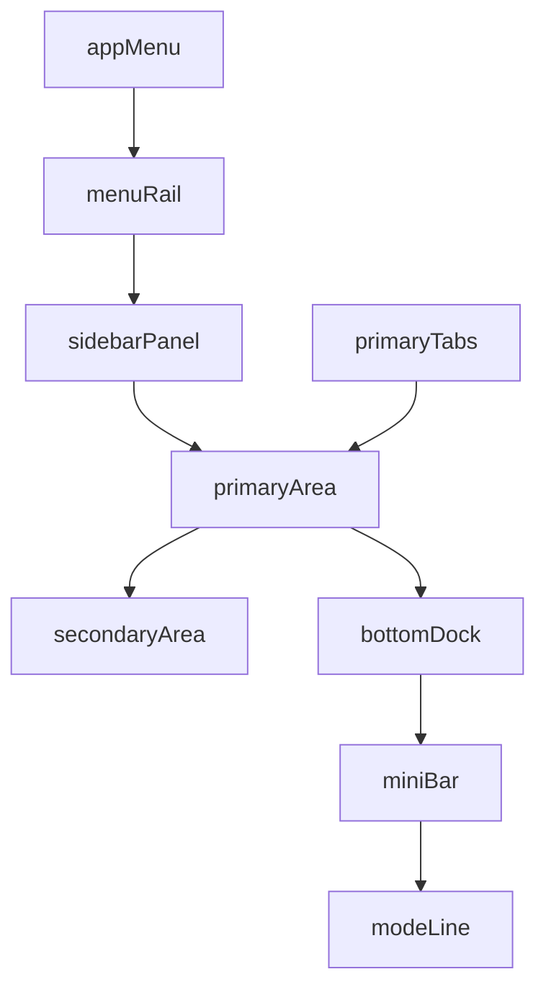

# Modular shell and plugins plan

## Goal

Make Nodex modular: a stable **core/shell** plus **UI+logic built as contributions** (plugins / first-party modules) from the ground up.

## Non-negotiable boundaries

- **Shell owns**: regions/layout, command registry + keymap, persistence of shell state, view mounting, capability/security boundaries, transport (IPC/HTTP), and a minimal host feedback surface (mode line).
- **Plugins/blocks own**: menu items, panel menus, panel bodies, primary tabs, secondary views, bottom dock tabs (output/terminal/notebook), and their own view state.
- **Everything is reachable via commands**: any UI action must map to a `nodex.shell.*` or domain command.

## Target layout (matches your sketch)

Regions (shell-defined “studs”):

- `appMenu` (top-left “N” menu; hierarchical)
- `menuRail` (left vertical menu items)
- `sidebarPanel` (panel menu + panel body)
- `primaryTabs` (tab strip)
- `primaryArea` (tab content)
- `secondaryArea` (context-bound view)
- `bottomDock` (output/terminal/notebook)
- `miniBar`
- `modeLine`

## Core data model (shell-owned)

### 1) Commands

Keep/expand the existing `NodexContributionRegistry` model:

- `id`, `title`, `category`, `doc`, `palette`, `miniBar`, `handler`
- Add optional `argsSchema` (JSON-schema-ish) later for safe minibuffer completion.
- **Execution**: commands are the *only* way to mutate shell state and invoke host behavior.

### 2) Views

Standardize a `ViewDescriptor` that can be mounted into a region:

- `id`, `title`, `defaultRegion`
- `iframeUrl|iframeHtml`, `sandboxFlags`
- `capabilities`: which commands/host APIs it can call

### 3) Tabs

Introduce `TabDescriptor` + `TabInstance`:

- `tabTypeId` (descriptor), `instanceId`
- `title`, `icon`, `dirty`, `closable`
- `serializeState()` / `restoreState()`

### 4) Context binding (Primary → Secondary)

Define a shell-owned `ActiveContext` object:

- `activePrimaryTab: { tabTypeId, instanceId, noteType?, noteId?, metadata? }`
- Secondary area receives this context via:
  - `postMessage` to iframe views, or
  - a shell “context API” callable from sandbox.

## Contribution registries (lego blocks)

Implement registries as shell-owned, pluggable catalogs.

### A) App menu (“N”) contributions

- `AppMenuItem`: `id`, `title`, `order`, `children?`, `commandId?`, `args?`, `enabledWhen?`
- Shell renders a clickable top-left **N** button that opens this hierarchical menu.
- Menu actions **must** map to commands (no direct UI side effects).

### B) Menu rail contributions

- `MenuRailItem`: `id`, `title`, `icon`, `order`, `onSelect` (command id or openView)
- Behavior: selecting a rail item opens a `sidebarPanel` view.

### C) Panel menu contributions

- `PanelMenuItem`: `id`, `title`, `order`, `when` predicate (based on active panel/view/context), runs a command.

### D) Primary tab contributions

- `PrimaryTabType`: `id`, `title`, `openCommandId`, `defaultRegion=primaryArea`
- Shell manages:
  - open/close/reorder
  - persistence of open tabs
  - restoring tabs on boot

### E) Bottom dock contributions

- `DockTab`: `id`, `title`, `order`, `viewId`
- Shell manages visibility + active dock tab.

### F) Mode line contributions

- `ModeLineItem`: `id`, `segment`, `priority`, `text`, `transient?`, `sourcePluginId?`
- Shell renders stacked segments and enforces ordering/collapsing rules.

## Shell-owned collapse/expand affordances (visual + command)

The shell must render **explicit open/close indicators** for:

- `sidebarPanel` (and optionally `menuRail` as a unit)
- `secondaryArea`
- `bottomDock` (output/terminal/notebook container)

Each affordance must have:

- **visual indicator** (collapsed/expanded state)
- **command** (toggle)
- **persisted state** (project prefs)

Proposed commands:

- `nodex.shell.toggle.sidebarPanel`
- `nodex.shell.toggle.secondaryArea`
- `nodex.shell.toggle.bottomDock`
- (optional) `nodex.shell.toggle.menuRail`
- `nodex.shell.toggle.miniBar`
- `nodex.shell.toggle.modeLine`

## Plugin lifecycle (how contributions register/unregister)

Define a consistent activation contract (works for first-party “bundled blocks” and external plugins):

- **Activate**: plugin receives a `contributes` API object and registers contributions; returns a list of disposables.
- **Deactivate**: shell calls all disposables; shell also closes any open views/tabs owned by the plugin (policy: close immediately if safe; otherwise prompt).

Conceptual shape:

- `activate(ctx, contributes): Disposable[]`
- `contributes.registerCommand(...)`
- `contributes.registerAppMenuItem(...)`
- `contributes.registerMenuRailItem(...)`
- `contributes.registerPanelMenuItem(...)`
- `contributes.registerDockTab(...)`
- `contributes.registerTabType(...)`
- `contributes.registerView(...)`
- `contributes.registerModeLineItem(...)`

## Capability model for sandboxed iframe views (security boundary)

Default: iframe views run with `sandbox="allow-scripts"` (no `allow-same-origin`).

### Allowed APIs (minimal, browser-safe)

Iframe views can only talk to the shell through an RPC bridge:

- `shell.commands.invoke(commandId, args?)`
- `shell.context.get()` (read-only active context snapshot)
- `shell.context.subscribe(cb)` (optional, event-based updates)

### Explicitly not allowed by default

- Direct access to `window.Nodex`
- DOM access to parent
- filesystem/network primitives (unless added later with explicit capability)

### Capability gating

Each `ViewDescriptor` includes `capabilities`:

- `allowedCommands: string[] | "allShellCommands" | "all"`
- `readContext: boolean`

Shell enforces gating inside the RPC handler (deny by default).

## Context propagation contract (Primary → Secondary, and views)

Shell owns `ActiveContext` and is the only writer.

### Context schema (minimum)

- `primary: { tabTypeId, instanceId, title?, noteId?, noteType?, metadata? } | null`
- `selection: { kind, ids[] } | null` (future)
- `workspace: { roots[], labels }` (optional)

### Delivery mechanism

- Shell sends `postMessage` events to each mounted iframe view:
  - `type: "nodex.context.update"`
  - `payload: ActiveContext`
- Views may request a fresh snapshot via RPC `shell.context.get()`.

## Persistence schema (project prefs) and versioning

Persist a single shell-owned blob (versioned) in project prefs:

- `shellState.version`
- `layout` (sizes + visibility + dock settings)
- `regions` (open view per region)
- `tabs` (open tab instances, order, active tab id, per-tab serialized state)

Rules:

- Shell must be able to start with defaults if persisted state is missing/invalid.
- Migration strategy: if `version` differs, run a pure function `migrate(old) -> new` or drop to defaults.

## Required shell-facing public APIs (DevTools and internal)

The shell must expose (internally, and optionally via `window.nodex.shell` for dev):

- `shell.layout.*` (get/set/toggle/resize)
- `shell.commands.*` (list/invoke)
- `shell.views.*` (register/list/open/closeRegion)
- `shell.appMenu.*` (register/list)
- `shell.menuRail.*` (register/list/select)
- `shell.tabs.*` (registerType/open/close/list/activate)
- `shell.panelMenu.*` (register/list for active panel)
- `shell.bottomDock.*` (registerTab/toggle/list/setActive)
- `shell.modeLine.*` (registerItem/unregister/update)

If `window.nodex.shell` is kept minimal for production, these still must exist as **commands** so everything is scriptable through minibuffer/palette.

## Incremental build order (keeps app usable)

1. **Define all registries + lifecycle**: `appMenu`, `menuRail`, `panelMenu`, `views`, `tabs`, `bottomDock`, `modeLine`.
2. **Chrome UI**: render your sketch layout with:
   - top-left `appMenu` button (N menu)
   - open/close indicators for `sidebarPanel`, `secondaryArea`, `bottomDock`
   - slots for rail/panel/tabs/views
3. **Shell commands + keymap**: implement command-driven toggles and focus.
4. **Iframe view host + RPC**: enforce capability gating + context propagation.
5. **First-party “core plugins”** (same APIs as third-party):
   - `Shell.CommandsPanel` (lists commands + runs them)
   - `Shell.OutputDock` (simple log/output)
   - `Shell.NotebookDock` (JS notebook/repl)
   - `Shell.MenuDefaults` (basic rail + app menu structure)
6. **Migration**: move one legacy surface at a time into plugin blocks (UI + logic behind commands/services).

## Migration policy (avoid regressions)

- Keep legacy UI available as a **single mountable view** until each capability has a plugin equivalent.
- For each migrated screen:
  - extract behavior into commands/services
  - replace UI calls with command invocations
  - mount new UI as a plugin view

## Deliverables

- A minimal shell that boots into blank chrome and is fully controllable via DevTools + minibuffer.
- A contribution system where UI is built from plugins (sandboxed iframes) and commands.
- A clear migration path that lets you revamp UI without losing functionality.

