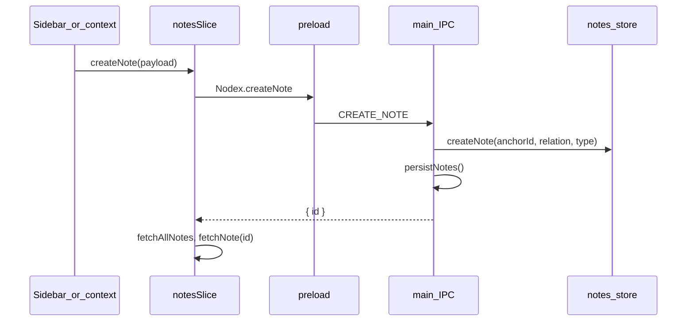

# Notes: creation, persistence, rendering, and tree DnD

This document describes how Nodex handles **note lifecycle** in this repo: creating nodes, durable storage, opening a note in a plugin iframe, and drag-and-drop in the sidebar tree. It separates **what is implemented today** from **optional / future** behavior.

---

## Scope

- **Create** — New note nodes under the workspace root (child / sibling / root-level).
- **Persist** — Save and restore the notes tree and note bodies.
- **Open** — Select a note; host loads the plugin UI in a sandboxed iframe.
- **Move** — Drag-and-drop (and menus) to reparent / reorder.

Related: [notes.md](./notes.md) (if expanded) for the in-memory model only.

---

## Creating a note (implemented)



- **Relations** (`CreateNoteRelation`): `child` | `sibling` | `root` (new note under workspace root, not a new workspace).
- **Implementation**: [`createNote` in `src/core/notes-store.ts`](../../src/core/notes-store.ts).
- **IPC**: [`CREATE_NOTE` handler in `src/main.ts`](../../src/main.ts) validates `type` against `registry.getRegisteredTypes()`.
- **UI**: [`handleCreateNote` in `src/renderer/App.tsx`](../../src/renderer/App.tsx) refreshes list and selects the new note.

---

## Persistence (implemented)

- **Store**: In-memory tree + records in `notes-store`; serialized to a **JSON file**, not a SQL DB.
- **Path**: `notes-tree.json` under Electron **`userData`** (e.g. `~/.config/<app>/notes-tree.json` on Linux).
- **API**: [`loadNotesState` / `saveNotesState` / `bootstrapNotesTree`](../../src/core/notes-persistence.ts).
- **Bootstrap**: On startup, load JSON; if missing or invalid, reset or seed sample tree, then save.

**Backlog wording**: “Persisted in DB” in older notes means **durable storage**; swapping in SQLite/LevelDB later would sit behind the same persistence boundary.

---

## Reuse and plugin UI state (implemented)

- **Same note id** — Content and `metadata` survive navigation if persisted.
- **Plugin UI snapshots** — Stored under `metadata` (host key for plugin UI state); hydrated on `HYDRATE_PLUGIN_UI` after `RENDER`.

There is no separate “note template” clone API; duplication would be a future feature.

---

## Plugin iframe loading (implemented + manifest flags)

**Host**: [`SecurePluginRenderer.tsx`](../../src/renderer/components/renderers/SecurePluginRenderer.tsx).

1. Fetches HTML bootstrap via `getPluginHTML`.
2. Injects sandboxed `srcdoc`; plugin script runs and posts `ready` (`MessageType.READY`).
3. Host then posts `RENDER` (and `HYDRATE_PLUGIN_UI` when snapshot exists).

**`READY` timing**: Fires after the injected script runs (synchronous end of bootstrap), **not** after async React data loads. Heavy UIs may still paint empty briefly unless they opt into deferred display (below).

**Host loading overlay**: Shown while the iframe is not yet ready to **display** (see below).

**Optional deferred display** (`manifest.json`):

- `deferDisplayUntilContentReady`: if `true`, the host keeps the loading overlay until the iframe posts `content_ready` (`MessageType.CONTENT_READY`). If `false` or omitted, overlay hides on `ready` (backward compatible).

**Plugin contract**: The host injects `window.Nodex` (postMessage, `postPluginUiState`, `notifyDisplayReady`, `onMessage`, etc.) in the sandbox bootstrap. **Prefer the host-owned SDK** for React UIs instead of hand-rolling `onMessage` / double-`rAF` display-ready logic.

### Plugin UI SDK (`@nodex/plugin-ui`)

- **Why host-owned** — The SDK stays aligned with the iframe protocol (`hydrate_plugin_ui`, `render` / `update`) and injected `window.Nodex`. Plugins do not import each other or a `plugin-sources/shared` tree; they only import this package, which the **app bundler resolves** from `packages/nodex-plugin-ui` when building `ui.bundle.js`.
- **What is injected vs imported** — `notifyDisplayReady` and the rest of `Nodex` are still implemented by the host HTML. The SDK is a thin, typed wrapper (React hooks) around that surface.
- **Hooks** (from `@nodex/plugin-ui`):
  - `useNodexIframeApi()` — `postMessage`, `postPluginUiState`, `notifyDisplayReady`.
  - `useNodexHostMessages({ onHydratePluginUi, onNotePayload })` — sets `window.Nodex.onMessage` with cleanup.
  - `useNotifyDisplayReady({ enabled? })` — double `requestAnimationFrame` then `notifyDisplayReady()` (e.g. TipTap: `enabled: !!editor`).
- **Bundler** — Forge’s plugin UI pipeline (dev esbuild + prod Rollup) resolves `@nodex/plugin-ui` to the monorepo package so the SDK is **inlined** into the plugin UI bundle (no separate global).
- **Plugin IDE typings** — Main process serves the SDK source as a Monaco extra lib (`PLUGIN_IDE_TYPINGS`) under a stable virtual URI (`file:///nodex-plugin-ui/index.ts`). The IDE sets TypeScript `paths` so `import … from "@nodex/plugin-ui"` gets completions and go-to-definition. **Run typecheck** uses the same path mapping via `resolveNodexPluginUiEntry()` in `plugin-typecheck.ts`.
- **Versioning** — Bump or document breaking changes when the iframe protocol or `Nodex` shape changes.

Minimal example:

```ts
import {
  useNodexHostMessages,
  useNotifyDisplayReady,
} from "@nodex/plugin-ui";

useNodexHostMessages({
  onHydratePluginUi: (state) => { /* … */ },
  onNotePayload: (payload) => { /* … */ },
});
useNotifyDisplayReady({ enabled: true });
```

Raw API (no React): `window.Nodex.notifyDisplayReady?.()` still works — it posts `content_ready` to the parent. Call after first meaningful paint (e.g. double `requestAnimationFrame` or after async init). Equivalent: `window.parent.postMessage({ type: "content_ready" }, "*")` if you must not rely on `Nodex`.

Seed plugins (`plugin-sources/markdown`, `plugin-sources/tiptap`, mirrored under `plugins/markdown` and `plugins/tiptap` for packaging) use the SDK for host messages and display-ready.

**Seeding**: On first run, `seed-user-plugins` copies from `plugins/<name>` when present, else from `plugin-sources/<name>` (dev, unpackaged).

---

## Sidebar drag-and-drop (implemented)

**File**: [`Sidebar.tsx`](../../src/renderer/components/Sidebar.tsx).

- **Placement**: Pointer band on row — before / after (sibling order) vs middle (nest as child). Stable `dragLeave` handling and deduped drop hints reduce flicker.
- **Feedback**: Inline, **non-reflowing** cues (lines / inset outline + compact labels such as **above (sibling)**, **below (sibling)**, **child**). No banner above the list that shifts the tree while dragging.

---

## Requirements backlog (from original draft)

| Topic | Status |
|--------|--------|
| Durable notes state | Done (JSON file) |
| Fast restore on launch | Done (bootstrap + Redux fetch) |
| Host loader while plugin boots | Done (overlay; extended if `deferDisplayUntilContentReady`) |
| Plugin signals display-ready | Done (`content_ready` + optional manifest flag) |
| Calm DnD with clear sibling vs child | Done (inline cues, no top strip) |
| Black lines / dotted child outline | Tuned in Sidebar (tokens may evolve) |

---

## Optional future work

- Replace JSON persistence with a real database or sync layer.
- `CONTENT_READY` timeout / fallback UX if a plugin forgets to signal.
- Prefer extending `window.Nodex` in the host sandbox bootstrap over cross-plugin shared source trees.
