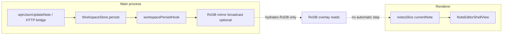

# Notes reload after writes (Electron + web)

**Goal:** Whenever a write operation updates persisted WPN data, both the web client and Electron should reflect the new state in the UI (sidebar list + open note body).

**Status:** Design / implementation plan (not yet shipped).

---

## Overview

Persisted WPN changes—including MCP’s local HTTP bridge (`PATCH /wpn/notes/:id`)—update main-process state and disk, but the renderer often keeps serving Redux `currentNote` until `fetchNote` runs again. That thunk is mostly tied to **tab `noteId` changes**, not to external writes.

A small **main → renderer “workspace persisted”** signal plus a **debounced Redux refetch** addresses Electron. Web and multi-client scenarios need the existing **sync/pull** path or explicit refetch after mutations.

---

## What happens today

- **Authoritative data** for the local file vault lives in the main process `WorkspaceStore.persist` (`src/core/workspace-store.ts`): every slot write ends by invoking the single `workspacePersistHook`.
- That hook is registered in `registerWorkspaceRxdbMirrorPersistHook` (`src/main/workspace-rxdb-mirror-broadcast.ts`) and **only** calls `scheduleWorkspaceRxdbMirrorBroadcast`, which:
  - No-ops unless `NODEX_LOCAL_RXDB_WPN` is enabled and authority mode is off.
  - Sends `WORKSPACE_RXDB_MIRROR_UPDATED` (`src/shared/ipc-channels.ts`) **only** to `ctx.mainWindow`, not every window.
- The renderer hydrates RxDB from that payload in `src/renderer/bootstrap/electron-nodex-idb-scratch-run.ts` via `importWorkspaceMirrorFromMainPayload` — **but nothing dispatches `fetchNote` / `fetchAllNotes` afterward**, so Redux stays stale.
- The open editor loads via `NoteEditorShellView` (`src/renderer/shell/first-party/NoteEditorShellView.tsx`): `useEffect` depends on `[dispatch, noteId]` only. If the same note is edited externally (e.g. MCP `PATCH`), **the UI does not refetch** until the user switches notes.
- **Web** (`createWebNodexApi` in `src/renderer/nodex-web-shim.ts`): reads/writes go over HTTP to the sync API. Another session updating the server is only visible after something runs **`runCloudSyncThunk`** / refetch—Electron gets a periodic nudge via `DESKTOP_SYNC_TRIGGER` (`src/main/create-main-window.ts`); the browser relies on `online` and manual sync in `initCloudSyncRuntime.ts` unless you add more triggers.

---

## Recommended approach

### 1. Electron (local WPN): always notify renderers after persist

- Add a **dedicated IPC** (e.g. `WORKSPACE_WPN_PERSISTED` in `src/shared/ipc-channels.ts`) fired from main whenever `workspacePersistHook` runs, **independent of** `NODEX_LOCAL_RXDB_WPN`.
- **Debounce** (~150 ms, same idea as the mirror broadcast) and send to **all** `BrowserWindow.getAllWindows()` (same pattern as `DESKTOP_SYNC_TRIGGER` in `src/main/create-main-window.ts`), not only `ctx.mainWindow`.
- **Preload** (`src/preload.ts`): expose `onWorkspaceWpnPersisted(cb)` parallel to `onWorkspaceRxdbMirrorUpdated`.
- **Renderer bootstrap** (next to `onWorkspaceRxdbMirrorUpdated` in `electron-nodex-idb-scratch-run.ts`): on callback, debounced:
  - `store.dispatch(fetchAllNotes())`
  - If `store.getState().notes.currentNote?.id` is set, `store.dispatch(fetchNote(thatId))`
- **Optional:** after `importWorkspaceMirrorFromMainPayload` (`src/renderer/workspace-rxdb/workspace-wpn-rxdb.ts`) completes, run the **same** refetch helper so mirror-only paths match the IPC path.
- **Conflict note:** a blind refetch can overwrite **unsaved local edits** if an external write lands while the user is typing. Possible mitigations: refetch only when the editor is not dirty; toast “note changed externally”; gate on `document.visibilityState` / focus. `noteContentSaveAppliedSeq` in `src/renderer/store/notesSlice.ts` already helps with stale **async save** completions after `fetchNote.fulfilled`; the harder case is **unsaved** buffer vs server.

### 2. Web (sync-api / nodex-web client)

- **Same tab after its own write:** ensure code paths that mutate WPN via HTTP then **dispatch `fetchAllNotes` + `fetchNote`** for the open note (same pattern as rename in `NoteEditorShellView`). Audit shell WPN mutations for missing refetch.
- **Another client wrote:** rely on **`runCloudSyncThunk`** / `cloudNotesSlice` hydration and/or add triggers (`visibilitychange`, `focus`, interval, or future server push).

### 3. MCP local HTTP → Electron UI

- No separate MCP hook is required: `src/main/wpn-local-http-bridge.ts` already calls `wpnJsonUpdateNote` → `persist(store)` (`src/core/wpn/wpn-json-notes.ts`). A persist-driven IPC covers MCP and in-app edits uniformly.

---

## Files likely touched

| Area | Files |
|------|--------|
| IPC + main | `src/shared/ipc-channels.ts`, `src/main/workspace-rxdb-mirror-broadcast.ts` (or a small sibling module), optionally `src/types/window.d.ts` |
| Preload | `src/preload.ts` |
| Renderer wiring | `src/renderer/bootstrap/electron-nodex-idb-scratch-run.ts`, small helper under `src/renderer/workspace-rxdb/` or `src/renderer/shell/` if needed to avoid import cycles with `store` |
| Optional | Same refetch after `importWorkspaceMirrorFromMainPayload` in `src/renderer/workspace-rxdb/workspace-wpn-rxdb.ts` |

---

## Implementation todos

1. **ipc-persist-channel** — Add IPC channel + debounced main broadcast to all `BrowserWindow`s from the workspace persist hook (alongside mirror schedule).
2. **preload-subscribe** — Expose preload API and window typings for renderer subscription.
3. **renderer-refetch** — On event: debounced `fetchAllNotes` + `fetchNote(current id)`; optionally mirror import path.
4. **web-cross-client** — Document or implement web-side refetch after local WPN HTTP mutations + sync pull triggers for other clients.

---

## Verification

- With `NODEX_WPN_LOCAL_HTTP=1`, PATCH a note via MCP while it is open in Electron: list + editor body should update within the debounce window.
- Two Electron windows on the same vault: both should refresh.
- With `NODEX_LOCAL_RXDB_WPN` off: UI should still refresh (proves IPC is not mirror-gated).
