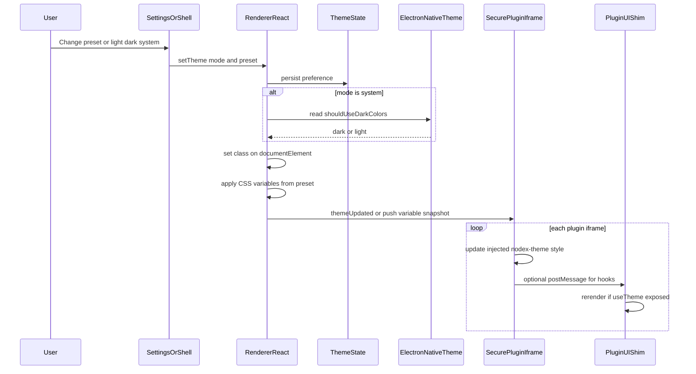

# Nodex theming and layout architecture

This document defines how **colors, typography, density, and shell layout** work in Nodex, how they stay consistent with **sandboxed plugin UIs**, and how they connect to **Tailwind**, **shadcn-style components**, and an optional **`@nodex/plugin-ui` SDK**.

**Related:** plugin security, iframe CSP, and the React bridge are described in [pluggins-archiecture-by-claude.md](./pluggins-archiecture-by-claude.md).

---

## Table of contents

1. [Goals and principles](#goals-and-principles)
2. [Three layers: primitives, semantics, components](#three-layers-primitives-semantics-components)
3. [Theme files: `style.nodexcss`](#theme-files-stylenodexcss)
4. [Semantic design tokens](#semantic-design-tokens)
5. [Tailwind and shadcn](#tailwind-and-shadcn)
6. [Layout architecture](#layout-architecture)
7. [Electron and OS theme](#electron-and-os-theme)
8. [Plugins: token injection and UI SDK](#plugins-token-injection-and-ui-sdk)
9. [Manifest and loader hooks](#manifest-and-loader-hooks)
10. [Theme change flow](#theme-change-flow)
11. [Accessibility and motion](#accessibility-and-motion)
12. [Migration plan (current codebase)](#migration-plan-current-codebase)

---

## Goals and principles

- **Configurable theming** — Users can switch presets (light, dark, Monokai, VS Code–like, etc.) without forking the app.
- **Semantic-first** — Application and plugin UI code reference **meaning** (`background`, `primary`, `sidebar-border`), not raw palette steps (`gray-200`), except rare exceptions.
- **Minimal, polished UI** — Simple components, consistent spacing and radius, responsive shell.
- **Modular shell** — Layout regions (sidebar, main, editors) are defined and documented; theme tokens apply across them uniformly.
- **Plugin alignment** — Plugins in iframes receive the same CSS variable contract so they can match Nodex; optional **`@nodex/plugin-ui`** supplies components built on that contract.

---

## Three layers: primitives, semantics, components

| Layer | What it is | Who uses it |
|--------|------------|-------------|
| **Primitives** | Spacing scale, radius steps, raw palette (e.g. OKLCH/HSL 50–950), font stacks | Theme authors only |
| **Semantics** | `--background`, `--sidebar-background`, `--editor-foreground`, etc. | App code, Tailwind theme mapping, plugins |
| **Components** | shadcn (or internal) primitives in the shell; **`@nodex/plugin-ui`** in plugins | Feature UI |

Plugins should almost never depend on **primitive** names; they use **semantic** variables (via CSS or SDK).

---

## Theme files: `style.nodexcss`

Use a **single conventional name** for the base theme file: **`style.nodexcss`** (`.nodexcss` marks Nodex-owned theme sources).

**Recommended contents (v1):**

- **CSS custom properties only** — `:root { … }` for light defaults, plus `.dark` or `[data-theme="dark"] { … }` for dark values.
- Values are typically **HSL components** (space-separated numbers) so Tailwind can use `hsl(var(--token))`, matching common shadcn patterns.

**Optional alongside the file:**

- **`theme.json`** — Metadata: `name`, `version`, `author`, `extends` (base preset id). Useful for validation, marketplace, and UI labels—not required for every color.

**Loading order (document as policy):**

1. Base `style.nodexcss` (required semantic set).
2. Mode / variant (same file as `.dark` block, or separate `light-style.nodexcss` / `dark-style.nodexcss` if you split).
3. Named presets (Monokai, etc.) that **override a subset** of the same variable names.
4. Optional user overrides (settings or patch file).

Specify whether merging is **last-write-wins per variable** or **structured merge** (only known keys).

**Naming note:** Avoid mixing `style` vs `styles` in filenames; standardize on **`style.nodexcss`** for the base file.

---

## Semantic design tokens

### Core (shadcn-aligned)

Used across shell, dialogs, and plugin content. Values are **HSL components** unless noted.

| Token | Role |
|--------|------|
| `--background` | App / page background |
| `--foreground` | Default text |
| `--card` | Raised surfaces (cards, panels) |
| `--card-foreground` | Text on card |
| `--popover` | Menus, popovers, dropdowns |
| `--popover-foreground` | Text on popover |
| `--primary` | Primary actions |
| `--primary-foreground` | Text on primary |
| `--secondary` | Secondary actions / muted buttons |
| `--secondary-foreground` | Text on secondary |
| `--muted` | Muted backgrounds |
| `--muted-foreground` | Secondary / de-emphasized text |
| `--accent` | Hover / selection tint |
| `--accent-foreground` | Text on accent |
| `--destructive` | Danger actions |
| `--destructive-foreground` | Text on destructive |
| `--border` | Default borders |
| `--input` | Input borders |
| `--ring` | Focus rings |
| `--radius` | Base border radius (**length**, e.g. `0.5rem`) |

### Shell (Nodex-specific)

| Token | Role |
|--------|------|
| `--sidebar-background` | Sidebar background |
| `--sidebar-foreground` | Sidebar default text |
| `--sidebar-primary` | Active nav / strong accent in sidebar |
| `--sidebar-primary-foreground` | Text on sidebar primary |
| `--sidebar-accent` | Sidebar row hover |
| `--sidebar-accent-foreground` | Text on sidebar accent |
| `--sidebar-border` | Sidebar separators |
| `--sidebar-ring` | Focus within sidebar (optional; can alias `--ring`) |

### Editor / note content

Especially important for plugins that render editors or readers.

| Token | Role |
|--------|------|
| `--editor-background` | Main editor / note area background |
| `--editor-foreground` | Body text in editor |
| `--editor-muted-foreground` | Placeholder, metadata |
| `--editor-border` | Editor chrome borders |
| `--editor-line-highlight` | Current line / soft highlight |
| `--editor-selection` | Selection background |
| `--editor-selection-foreground` | Selection text (if needed) |
| `--code-background` | Inline / fenced code background |
| `--code-foreground` | Code text |

### Chrome / layout helpers

| Token | Role |
|--------|------|
| `--resize-handle` | Panel splitter idle |
| `--resize-handle-hover` | Splitter hover |
| `--resize-handle-active` | Splitter dragging |
| `--titlebar-background` | Custom title bar (if used) |
| `--titlebar-foreground` | Title bar text |
| `--scrollbar-thumb` | Scrollbar thumb (optional) |
| `--scrollbar-track` | Scrollbar track (optional) |

### Motion (optional)

| Token | Role |
|--------|------|
| `--transition-duration` | Default transition (e.g. `150ms`) |
| `--transition-timing` | Easing function |

---

## Tailwind and shadcn

- **Tailwind** — Extend the theme in [`tailwind.config.js`](../../tailwind.config.js) so colors reference semantics, e.g. `background: 'hsl(var(--background))'`, `sidebar: { DEFAULT: 'hsl(var(--sidebar-background))', … }`, `editor: { … }`.
- **`darkMode`** — Prefer `'class'` on `<html>` (or `data-theme`) so Electron can follow **system** or **explicit** user choice.
- **shadcn** — Shell components consume the same semantic tokens; keep **one** token source (`style.nodexcss` or generated CSS) imported from the renderer entry (e.g. [`src/renderer/styles.css`](../../src/renderer/styles.css)).
- **No raw grays in feature code** — Once tokens exist, prefer `bg-background`, `border-border`, `text-muted-foreground`, etc., over `bg-gray-100` in the main app.

---

## Layout architecture

**Layout** (regions, sizes, persistence) is **orthogonal** to **theme** (color, type, radius).

- **Regions** — Sidebar, main content, optional secondary panel; document min/max sizes and persistence (e.g. `react-resizable-panels` / `PanelGroup` with `autoSaveId`).
- **Responsive behavior** — Below certain breakpoints, sidebar may collapse to overlay/drawer; document breakpoints and behavior.
- **Resize handles** — Use semantic tokens (`--resize-handle*`) so handles match the active theme.

Current shell entry: [`src/renderer/App.tsx`](../../src/renderer/App.tsx).

---

## Electron and OS theme

- On startup, read `nativeTheme.shouldUseDarkColors` when user preference is **system**.
- Subscribe to `nativeTheme` **updated** events to react to OS changes.
- Persist **explicit** user choice (`light` / `dark` / `system`) in app settings.
- Optional: custom **frameless** window chrome uses `--titlebar-*` so it does not drift from the shell.

---

## Plugins: token injection and UI SDK

Sandboxed plugin iframes **do not inherit** the host document’s `:root` variables automatically.

**Host responsibility**

1. Keep a **canonical** representation of the active theme (same variables as the renderer).
2. When creating or updating plugin documents, **inject** a `<style id="nodex-theme">` (or equivalent) defining `:root` / `.dark` for the iframe’s `<html>`.
3. On **theme change**, push updates to every active plugin frame (`postMessage` and/or DOM update to the injected style).

**CSP** — Inline theme styles align with strict plugin CSP patterns documented in the plugin guide; avoid loading arbitrary external theme URLs unless allowlisted.

**`@nodex/plugin-ui` (recommended SDK)**

- Versioned **npm package** built against **`window.Nodex.React`** (bridge) and the **same semantic variables**.
- Supplies Button, Input, tabs, lists, etc., so plugins match Nodex without importing the host bundle.
- **Versioning** — Align SDK major/minor with Nodex design-system breaks; see manifest hooks below.

---

## Manifest and loader hooks

Optional fields on **`manifest.json`** (plugins):

| Field | Type | Purpose |
|--------|------|---------|
| `designSystemVersion` | semver string | Expected `@nodex/plugin-ui` / token schema compatibility |
| `theme` | `"inherit"` \| `"isolated"` | `inherit` (default): host injects theme CSS; `isolated`: no injection, optional UI warning |
| `minNodexVersion` | semver string | Host compatibility gate (if not already present) |

**Loader behavior**

- Compare `designSystemVersion` to a host **compatibility matrix**; warn or block in Plugin Manager as policy dictates.
- Respect `theme: "isolated"` for advanced plugins that ship a fully custom look.

---

## Theme change flow

---

## Accessibility and motion

- **`prefers-reduced-motion`** — In global theme CSS, set `--transition-duration: 0ms` and/or reduce animations.
- **`prefers-contrast`** — Optional high-contrast preset or extra semantic overrides.
- **Focus** — `--ring` must remain visible; document contrast expectations against `--background`.
- **Typography** — Prefer `rem` / token-based scale for body text; avoid fixed `px` for primary reading sizes.

---

## Migration plan (current codebase)

**Phase 0 — Foundation**

1. Add `src/renderer/styles/tokens.css` (or `style.nodexcss` consumed into the build): `:root`, `.dark`, reduced-motion rules.
2. Extend [`tailwind.config.js`](../../tailwind.config.js) with semantic color mappings (`background`, `foreground`, `sidebar`, `editor`, `resize-handle`, …).
3. Import tokens in [`src/renderer/styles.css`](../../src/renderer/styles.css) before component styles.
4. Add a small theme controller: `darkMode: 'class'`, persist preference, listen to `nativeTheme` when using system mode.

**Phase 1 — Shell**

5. [`src/renderer/App.tsx`](../../src/renderer/App.tsx) — Replace `bg-gray-*` / ad-hoc borders with semantic utilities; map panel resize handle to `--resize-handle*`.
6. [`src/renderer/components/Sidebar.tsx`](../../src/renderer/components/Sidebar.tsx) — Map sidebar surfaces to `--sidebar-*` tokens.

**Phase 2 — Other renderer features**

7. Plugin Manager, Plugin IDE, NoteViewer, modals — same semantic pass.

**Phase 3 — Plugin pipeline**

8. [`src/renderer/components/renderers/SecurePluginRenderer.tsx`](../../src/renderer/components/renderers/SecurePluginRenderer.tsx) (or equivalent) — Inject theme CSS into iframe; sync on theme change; align with [plugin architecture](./pluggins-archiecture-by-claude.md).

**Phase 4 — Presets**

9. Add preset files (e.g. `themes/monokai.nodexcss`) overriding the same variable names; select via settings.

**Phase 5 — Hardening**

10. Optional ESLint rule to discourage raw Tailwind palette classes in `src/renderer`.
11. Internal theme gallery / Storybook for components × presets.

---

## Summary

| Concern | Mechanism |
|---------|-----------|
| Token definitions | `style.nodexcss` (+ optional `theme.json`) |
| Shell UI | Tailwind semantic colors + shadcn-style components |
| Layout | Panel regions, tokens for resize chrome only |
| OS sync | Electron `nativeTheme` + persisted user mode |
| Plugin look | Inject same CSS variables; optional `@nodex/plugin-ui` |
| Compatibility | `designSystemVersion`, `theme` on plugin manifest |

This document should be updated when the token list or manifest schema changes.
