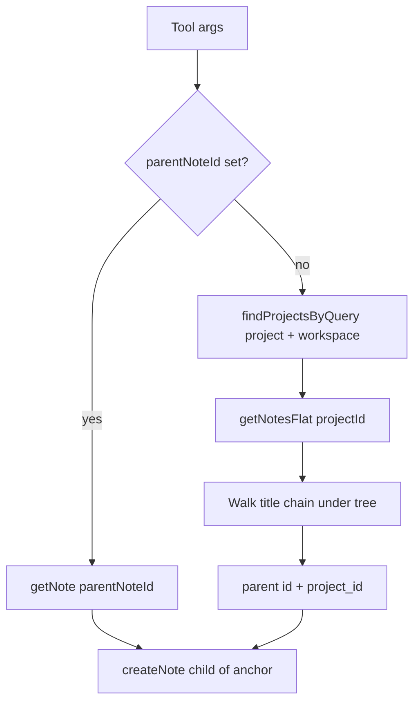

# MCP child-note creation by id or nested path

This document is the project-local copy of the implementation plan for `nodex_create_child_note` and the Cursor command `.cursor/commands/nodex-create-child-note.md`. The canonical Cursor plan may also exist under your global `.cursor/plans/` directory.

## Implementation checklist

- [ ] Add `resolve-parent-in-tree.ts` (+ tests): map flat notes, walk `parentPathTitles`, ambiguous/none results
- [ ] Type `getNotesFlat` return as list items with `id`, `parent_id`, `title`, `sibling_index`
- [ ] Register `nodex_create_child_note` in `server.ts` with zod input (id XOR workspace+project+path), update `MCP_INSTRUCTIONS` + `packages/nodex-mcp/README.md`
- [ ] Add `.cursor/commands/nodex-create-child-note.md` with trigger steps, MCP references, Clarifications

## Current state

- Creating a child when you already have the parent UUID is already supported: [`nodex_write_back_child`](../packages/nodex-mcp/src/server.ts) (`taskNoteId` → `getNote` → `createNote` with `relation: "child"`) and [`nodex_write_note`](../packages/nodex-mcp/src/server.ts) with `mode: "create_child"` (`projectId` + `anchorId`).
- Path-like resolution today is **flat**: [`nodex_resolve_note`](../packages/nodex-mcp/src/server.ts) and [`nodex_find_notes`](../packages/nodex-mcp/src/find-wpn.ts) match **workspace + project + a single note title** against [`/wpn/notes-with-context`](../apps/nodex-sync-api/src/wpn-routes.ts) rows; paths are always `Workspace / Project / Title` ([`find-wpn.ts` line 232](../packages/nodex-mcp/src/find-wpn.ts)).
- The sync API already exposes a **tree** for a project: [`GET /wpn/projects/:projectId/notes`](../apps/nodex-sync-api/src/wpn-routes.ts) returns preorder rows with `id`, `parent_id`, `title`, `depth`, etc. ([`WpnNoteListItemOut`](../apps/nodex-sync-api/src/wpn-routes.ts)). The MCP client already calls this via [`WpnHttpClient.getNotesFlat`](../packages/nodex-mcp/src/wpn-client.ts) but types the result as `unknown[]`.

## Goal

1. **New MCP tool** that creates a new note as a **direct child** of a parent resolved by:
   - **`parentNoteId`** (UUID), or
   - **`workspaceName` + `projectName` + `parentPathTitles`**: ordered titles from a **root note** down to the **parent** (each step: pick among **direct children** of the current node; matching uses the same `norm` as [`resolve-note.ts`](../packages/nodex-mcp/src/resolve-note.ts)), or
   - **`parentWpnPath`** (optional convenience): a single string `"Workspace / Project / Title1 / Title2 / ..."` where the first two segments are workspace and project names and the remaining segments are `parentPathTitles`. Document that this splits on **` / `** (space-slash-space), so titles containing that substring cannot be represented reliably in this form (use structured fields or `parentNoteId` instead).

2. **Child payload**: `title`, `content`, optional `type` (default `markdown`), optional `metadata` — aligned with `writeBackChildInput` in [`server.ts`](../packages/nodex-mcp/src/server.ts).

3. **New Cursor command doc** (separate file, same style as [`.cursor/commands/nodex-execute-note-id.md`](../.cursor/commands/nodex-execute-note-id.md)): tells the agent how to start from user input (UUID vs path string vs structured path), which MCP tools to call (`nodex_create_child_note` as primary; `nodex_auth_status` / browser login if needed; `nodex_find_projects` / `nodex_list_wpn` only as fallbacks for disambiguation), and includes a **Clarifications** section (path format, ambiguous workspace/project, duplicate sibling titles, slash-in-title caveat, default type, empty title behavior).

## Implementation sketch

- **Resolve project**: Reuse [`findProjectsByQuery`](../packages/nodex-mcp/src/find-wpn.ts) with `query = projectName` and `workspaceQuery = workspaceName`. If status is not `unique`, return JSON similar to existing tools (message + candidates) without creating a note.
- **Walk tree**: New pure module (e.g. [`packages/nodex-mcp/src/resolve-parent-in-tree.ts`](../packages/nodex-mcp/src/resolve-parent-in-tree.ts)):
  - Parse flat list into a `parent_id → children[]` map (sorted by `sibling_index` like the API).
  - Start from `parent_id === null` notes for the first title segment; for each next segment, descend among current node’s children.
  - **Duplicate sibling titles** (same parent, same normalized title): return `ambiguous` with all matching note ids and a human-readable path for each (walk up `parent_id` to build `TitleA / TitleB / ...`).
  - **No match**: return `none` with a short message.
- **UUID branch**: `getNote(parentNoteId)`; use `note.project_id` and `note.id` as anchor (same as write-back). Optionally verify note belongs to expected workspace/project if those were also passed (strict mode) — default **ignore** extra fields when `parentNoteId` is set to keep the API simple; document in Clarifications.
- **Register tool** in [`packages/nodex-mcp/src/server.ts`](../packages/nodex-mcp/src/server.ts): e.g. `nodex_create_child_note`, `requireCloudAccess`, then `createNote` + invalidate cache (already inside `WpnHttpClient.createNote`).
- **Typing**: Introduce a small type for list items (mirror `WpnNoteListItemOut`) and use it in `getNotesFlat` return type for safer parsing.
- **Tests**: New unit tests for `resolve-parent-in-tree.ts` (unique chain, missing segment, ambiguous siblings, multiple roots) in `packages/nodex-mcp/src/resolve-parent-in-tree.test.ts`.
- **Docs**: Update [`packages/nodex-mcp/README.md`](../packages/nodex-mcp/README.md) and the `MCP_INSTRUCTIONS` string in `server.ts` to mention the new tool and how it relates to `nodex_write_back_child` / `nodex_write_note` (intentional overlap: convenience when parent is identified by path).

## Cursor command file

- Add [`.cursor/commands/nodex-create-child-note.md`](../.cursor/commands/nodex-create-child-note.md) (name can be adjusted to your naming convention).
- Structure:
  - **Purpose**: user provides parent (UUID or path) + desired child title/body (from same message or follow-up).
  - **Steps**: authenticate if needed (reuse the browser flow block from [`nodex-execute-note-id.md`](../.cursor/commands/nodex-execute-note-id.md)); call `nodex_create_child_note`; on `workspace_ambiguous` / `project_ambiguous` / path ambiguity, surface candidates and ask user to narrow or pass UUID.
  - **MCP tool references**: explicitly name `nodex_create_child_note`, `nodex_auth_status`, `nodex_login_browser_start`, `nodex_login_browser_poll`, and secondary tools `nodex_find_notes` / `nodex_list_wpn` for exploration if resolution fails.
  - **Clarifications**: nested path = chain of **note titles under the project**, not workspace/project in the tail; separator for `parentWpnPath`; duplicate titles; auth mode; when to prefer `parentNoteId` after ambiguity.

## Out of scope (expanded for this task)

These items are **explicitly not** part of the current deliverable. They are documented so follow-up work stays traceable.

### Server-side API and backend

- **No new routes or response shapes** in [`apps/nodex-sync-api`](../apps/nodex-sync-api): child creation stays `POST /wpn/projects/:projectId/notes` with `relation: "child"` and `anchorId` (existing write path). The MCP tool only **reads** the existing flat tree from `GET /wpn/projects/:projectId/notes`.
- **No `notes-with-context` extension** to embed full parent chains: that endpoint remains a flat catalog for search/linking; nested resolution is intentionally client-side over the per-project notes list.
- **No server-side “resolve path string” endpoint**: avoids duplicating tree-walk logic in two languages and keeps auth and validation in one MCP layer for now. A future API could centralize resolution for non-MCP clients or for very large trees (with caching).
- **No pagination or partial-tree APIs**: the implementation assumes the project’s note list fits a single `getNotesFlat` response (current product assumption). If projects grow huge, a follow-up might add cursor pagination or server-side path resolution.

### Agent UX and content generation

- **No automatic child title or body**: the tool and command do not invent `title`/`content` from context (e.g. “New note”, timestamp, or LLM-generated draft). The Cursor command should **ask the user once** if either is missing, or fail closed with a clear message—no silent defaults beyond `type` defaulting to `markdown` where already agreed.
- **No template system** (meeting notes, bug report skeletons, etc.) for new children.
- **No batch creation** (many children in one MCP call) or transactional “create tree” operations.

### Product, tooling, and consolidation

- **No deprecation or removal** of [`nodex_write_back_child`](../packages/nodex-mcp/src/server.ts) or [`nodex_write_note`](../packages/nodex-mcp/src/server.ts) `create_child`: they remain the lower-level / task-write-back paths; the new tool is additive convenience.
- **No updates to Cursor MCP tool JSON mirrors** under `.cursor` or other generated descriptors unless your repo has an explicit sync script—if such files exist in a fork or local setup, refreshing them is a separate housekeeping step.
- **No Electron/local-loopback-specific behavior** beyond what existing `WpnHttpClient` already does: same tool works for cloud token or local WPN URL as today.

### Edge cases deferred to documentation + Clarifications (not new product rules)

- **Strict cross-check** when both `parentNoteId` and workspace/project are supplied (e.g. reject if note is not under that project): out of scope unless we add a flag later; plan defaults to ignoring extra fields when UUID is set.
- **Titles containing ` / `** when using `parentWpnPath`: handled only by documenting the limitation and steering users to `parentPathTitles[]` or UUID—not by inventing a new escaping protocol in this task.
