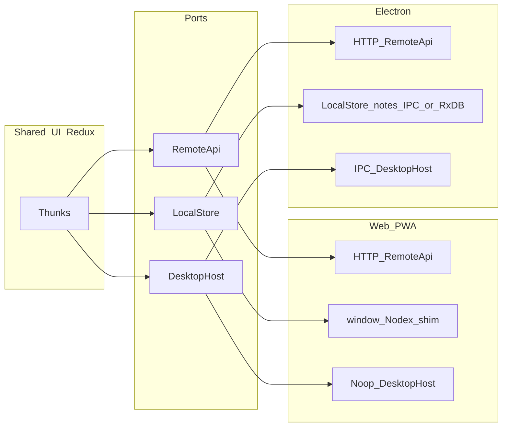

# Architecture Decision Record — Nodex Offline-First Monorepo

> **Last updated**: April 2026  
> **Status**: Active  
> **Location (this tree)**: `/home/jehu/Workspace/Nodex-Studio/nodex` — npm workspaces + Electron Forge; Next.js app under `apps/nodex-web`.

---

## 1. Executive Summary

Nodex is a **multi-client knowledge workspace**: **web (Next.js PWA)** for users who want immediate access with **server-held data**; **Electron** for **desktop UX** and **offline-first** local persistence, still syncing to the **same HTTP API** when online. **Redux** remains the UI/session layer; **platform ports** (`RemoteApi`, `LocalStore`, `DesktopHost`) isolate HTTP vs IPC vs local persistence. **Mobile (Expo)** is **phase 2** — share `RemoteApi` contracts and types from [`packages/nodex-platform`](packages/nodex-platform).

Target **MongoDB + Fastify** sync API and **RxDB (Dexie) in the Electron renderer** remain the north-star for full offline sync; the legacy **Express** headless API (**JSON workspace + file auth**, no `pg`) coexists during incremental migration. **ADR-017** commits the **hosted** path to **Mongo as server source of truth**, **web server-authoritative first**, and **Electron offline-first + sync**.

---

## 2. Repository Layout (this repo)

```
nodex/
├── apps/
│   ├── nodex-web/          Next.js 16 — PWA manifest + sw.js, Tailwind v4, shared renderer UI
│   └── nodex-sync-api/     Fastify 5 + MongoDB — /auth/*, /sync/push, /sync/pull (ADR-003/005)
├── packages/
│   ├── nodex-platform/     Ports + createFetchRemoteApi (HTTP) + createNodexPlatformDeps()
│   ├── nodex-shell-ui/
│   └── nodex-plugin-ui/
├── src/
│   ├── main/               Electron main (incl. 30s DESKTOP_SYNC_TRIGGER → renderer)
│   ├── preload.ts          contextBridge: Nodex + nodexDesktop.onSyncTrigger
│   ├── renderer/           React + Redux; registerDesktopSyncNudge(platformDeps)
│   └── nodex-api-server/   Legacy headless API (Express, JSON workspace, :3847)
├── forge.config.js
├── package.json            workspaces: apps/nodex-web, apps/nodex-sync-api, packages/*
└── docs/repository/        ADR + planning markdown (this file, PLUGIN_SYSTEM, etc.)
```

---

## 3. Architectural Decisions

---

### ADR-001 — Incremental evolution in this repo (supersedes greenfield-only)

**Status**: Accepted (revised April 2026)  
**Context**: An earlier option was a fully greenfield `nodex-nextjs` monorepo with no carry-over. Product direction now requires **the same UI and Redux**, **web PWA** (server-trusting), and **Electron** (offline + desktop) sharing one mental model.  
**Decision**: **Evolve this repository** — keep the renderer UI and Redux; add **`@nodex/platform`** ports and wire **Redux thunks** to `extra.localStore.notes` instead of calling `window.Nodex` directly. Introduce **Fastify + MongoDB + RxDB sync** incrementally alongside or replacing legacy API paths as needed.  
**Rationale**:
- Removing Redux or re-skinning the entire shell would be more expensive than a bounded data-layer migration.
- Explicit ports prevent web bundles from importing Electron and keep **HTTP** vs **IPC** responsibilities clear.
- One git history and one release train for web + desktop until mobile ships.

**Consequences**: Some documentation below still describes an ideal **Turborepo** layout (`apps/api`, `apps/mobile`); this repo may lag that layout until those targets are added. **Mobile is explicitly deferred** (see §11).

---

### ADR-002 — Turborepo monorepo with npm workspaces

**Status**: Accepted  
**Context**: Four apps (web, desktop, mobile, API) and one shared package must all depend on the same schemas and sync logic without duplicating code or publishing to npm.  
**Decision**: Use Turborepo + npm workspaces with a single `node_modules` at the root.  
**Rationale**:
- `packages/shared` is referenced as `@nodex/shared: "*"` — changes propagate instantly without a build/publish step.
- Turbo's task graph ensures `shared` is always built before apps that depend on it.
- A single `npm install` at root installs everything for all apps.

**Consequences**: Mobile (Expo) requires special handling because Metro doesn't support symlinked workspace packages by default. A `metro.config.js` with `watchFolders` must be added when building the mobile app.

---

### ADR-003 — MongoDB as the sole backend database (sync API)

**Status**: Accepted  
**Context**: The main **headless Express API** persists WPN and legacy notes in a **JSON workspace file** under the open project; auth uses **JSON files** under user data. **`apps/nodex-sync-api`** is the **MongoDB** service for cloud sync. Historically, Postgres/SQLite added deployment complexity for multi-DB setups; the sync path standardizes on MongoDB for server-side sync documents.  
**Decision**: Use MongoDB (e.g. Atlas) as the database for **`nodex-sync-api`** sync storage.  
**Rationale**:
- The sync data model (documents with `id`, `updatedAt`, `deleted`, `version`) maps naturally to MongoDB documents — no ORM or schema migration tooling needed.
- MongoDB's `bulkWrite` with `upsert` is exactly the operation needed for `POST /sync/push`.
- The `updatedAt` range query (`$gt: since`) for `GET /sync/pull` is trivially indexed.
- Keeps sync concerns in one document store; avoids coupling sync to the headless workspace file.
- Atlas free tier is sufficient for development and low-traffic production.

**Consequences**: Full-text search and complex relational queries require MongoDB Atlas Search or denormalization. Acceptable given the notes use case.

---

### ADR-004 — RxDB as the client-side local database

**Status**: Accepted  
**Context**: The app must work fully offline. Local data must be reactive (UI updates immediately on write without explicit re-fetches).  
**Decision**: Use RxDB v15 with platform-specific storage adapters.  
**Rationale**:
- RxDB provides reactive queries via RxJS observables — UI subscribes to a query and re-renders automatically when local data changes.
- Offline writes are first-class — insert/update works with no network.
- The same schema definition (`NOTE_SCHEMA`) runs on all three client platforms.
- Built-in soft-delete pattern aligns exactly with the sync protocol.

**Storage adapter choices**:
| Platform | Storage | Reason |
|---|---|---|
| Web | Thin shim + HTTP (PWA); optional RxDB later (ADR-013) | Current product choice: server-first web; full RxDB on web is optional |
| Desktop | `rxdb/plugins/storage-dexie` (IndexedDB via Electron renderer) | Electron's renderer process has full DOM APIs including IndexedDB |
| Mobile | `rxdb/plugins/storage-sqlite` via `expo-sqlite` | SQLite is the only persistent storage on React Native |

**Note on Desktop SQLite**: `rxdb/plugins/storage-sqlite` is a **premium** RxDB feature. The desktop app intentionally uses Dexie (IndexedDB) in the renderer process rather than paying for premium. See ADR-007.

---

### ADR-005 — Custom REST sync engine (no Firebase, no GraphQL, no third-party sync)

**Status**: Accepted  
**Context**: Several sync solutions exist: Firebase Realtime DB, PouchDB/CouchDB, GraphQL subscriptions, Hasura.  
**Decision**: Build a minimal bidirectional REST sync engine from scratch.  
**Rationale**:
- **No vendor lock-in** — the entire sync protocol is owned and can be extended.
- **Simplicity** — two endpoints cover all sync needs:
  - `POST /sync/push` — client sends changed documents, server applies newer ones
  - `GET /sync/pull?collection=&since=` — client fetches server changes since last sync
- The "last-write-wins" conflict model is sufficient for a notes app where concurrent edits on the same note are rare.
- REST is universally accessible from web, Electron, and React Native without platform-specific SDKs.

**Sync flow**:
```
1. Client collects local docs where updatedAt > lastSync OR deleted = true
2. POST /sync/push  →  server applies newer, returns conflicts
3. Client applies conflicts (server wins)
4. GET /sync/pull?since=lastSync  →  client upserts server changes
5. Store new lastSync timestamp
```

**Triggers**:
- App start
- `window`/`NetInfo` online event
- 30-second interval (background)
- Desktop: main process IPC trigger (see ADR-007)

---

### ADR-006 — Conflict resolution: last-write-wins by `updatedAt`

**Status**: Accepted  
**Context**: Two clients may edit the same note while offline. On sync, both submit their version.  
**Decision**: Server-enforced last-write-wins: the document with the larger `updatedAt` timestamp always wins.  
**Rationale**:
- Operational simplicity — no CRDT overhead, no merge UI.
- Notes are usually edited on one device at a time; true simultaneous conflicts are rare.
- The losing client receives the winning version as a conflict in the push response and immediately overwrites its local copy.

**Implementation** (in `POST /sync/push`):
```
if server.updatedAt > client.updatedAt  →  reject, return server version as conflict
if client.updatedAt >= server.updatedAt →  overwrite server (bulkWrite upsert)
```

**Consequences**: If a user edits the same note on two offline devices simultaneously, the later-syncing device's changes are silently overwritten. Acceptable trade-off vs. complexity of CRDT or three-way merge for v1.

---

### ADR-007 — Desktop: sync triggered by main process via IPC, not owned by main process

**Status**: Accepted  
**Context**: The plan specified "sync handled via background process or main process" for Electron. The natural implementation would be to run the RxDB database and sync loop in the main process using SQLite storage.  
**Decision**: The RxDB database lives in the **renderer process** (Dexie/IndexedDB). The **main process** only owns a 30-second interval timer that sends `sync:trigger` IPC to the renderer.  
**Rationale**:
- `rxdb/plugins/storage-sqlite` (main process SQLite) requires **RxDB Premium** — a paid subscription. Avoiding this keeps the stack fully open-source.
- Electron's renderer process has full browser APIs including IndexedDB, so Dexie storage works identically to the web app.
- Keeping the database in the renderer avoids IPC serialization overhead for every read/write (reads happen inline in React components via RxJS subscriptions).
- The sync trigger pattern still ensures the timer survives renderer suspension/throttling because it originates in the main process.

**IPC contract** (via `contextBridge`):
```typescript
window.nodexDesktop.onSyncTrigger(callback: () => void) => () => void
```
**Implementation in this repo**: channel `IPC_CHANNELS.DESKTOP_SYNC_TRIGGER` (`"desktop:sync-trigger"`). Main process (`create-main-window.ts`) starts a **30s interval** after `did-finish-load` and `webContents.send`s that channel; preload subscribes with `ipcRenderer.on` and invokes the callback. Renderer **HTTP sync** (future `RemoteApi.syncPush` / `syncPull`) runs in the renderer; IPC **only nudges** the loop, matching ADR-007 intent.

---

### ADR-008 — Fastify over Express for the API server

**Status**: Accepted  
**Context**: The existing `nodex` API uses Express. The plan allowed "Fastify or Express".  
**Decision**: Use Fastify v5.  
**Rationale**:
- Fastify is ~2x faster than Express in benchmarks for JSON-heavy workloads.
- Built-in schema validation via JSON Schema (Zod used additionally for request body validation).
- Native async/await support without the `express-async-errors` shim.
- `@fastify/jwt` and `@fastify/cors` are first-party maintained plugins.
- Top-level `await` in `server.ts` means startup is clean sequential code with no callback nesting.

---

### ADR-009 — JWT authentication (stateless, no sessions)

**Status**: Accepted  
**Context**: Auth is needed for the sync endpoints to scope documents per user.  
**Decision**: JWT Bearer tokens signed with HS256, stored in `localStorage` (web/desktop) and `expo-secure-store` (mobile).  
**Rationale**:
- Stateless — no session store, no Redis dependency.
- Works identically across all three client platforms.
- `expo-secure-store` on mobile uses iOS Keychain / Android Keystore — secure against extraction.
- JWT payload contains `userId` and `email` only — minimal surface area.

**Security notes**:
- `JWT_SECRET` must be at least 32 random bytes in production (enforced by env validation at startup).
- Tokens have no expiry set in v1 — add `expiresIn: "7d"` and refresh token logic before production deployment.
- All sync endpoints require `Authorization: Bearer <token>` — missing or invalid token returns 401.

---

### ADR-010 — TailwindCSS v4 for web styling

**Status**: Accepted  
**Context**: Need a utility-first CSS framework. TailwindCSS v3 is the stable choice; v4 is the new architecture.  
**Decision**: Use TailwindCSS v4 with `@tailwindcss/postcss`.  
**Rationale**:
- v4 uses a CSS-first config (`@import "tailwindcss"`, `@source`) — no `tailwind.config.js` needed.
- Faster build times via Lightning CSS (Rust-based).
- The web app supplements Tailwind utilities with CSS custom properties (`--background`, `--primary`, etc.) for theming, giving runtime dark mode without JS.

**PostCSS config** (`apps/web/postcss.config.mjs`):
```js
export default { plugins: { "@tailwindcss/postcss": {} } }
```

**Known issue resolved**: Without `postcss.config.mjs`, Next.js does not process the `@import "tailwindcss"` directive — all utility classes are silently dropped. This caused the initial broken UI. Fixed by adding the config file.

---

### ADR-011 — Hydration safety: localStorage read deferred to useEffect

**Status**: Accepted  
**Context**: `AuthContext` initially read `localStorage` inside `useState` initializer. During Next.js SSR the server renders `token: null` but the browser might have a stored token — causing a React hydration mismatch error.  
**Decision**: Always initialize auth state as `{ token: null, ready: false }`. Read `localStorage` inside `useEffect` (client-only) and set `ready: true` when done.  
**Rationale**:
- Server and client both render the same initial state (`null`, `false`) → no hydration mismatch.
- The `ready` flag prevents a flash of the auth screen for logged-in users — a spinner shows instead until the token check completes (< 1ms).
- Pattern is reusable for any client-only state (theme preferences, cached user data, etc.).

---

### ADR-012 — Soft delete pattern for all documents

**Status**: Accepted  
**Context**: Deleting a document from the client's RxDB and from MongoDB would break sync — the server can't send "delete this" instructions to clients that haven't synced yet.  
**Decision**: All deletions set `deleted: true` and update `updatedAt`. Documents are never physically removed from either the local or server database during normal operation.  
**Rationale**:
- The pull endpoint (`GET /sync/pull?since=...`) returns deleted documents — clients receiving them know to soft-delete their local copy.
- Eliminates a class of sync bugs where a re-connected client re-uploads a document the user deleted.
- Physical cleanup (hard delete of old deleted records) can be implemented as a periodic background job on the server without affecting client sync correctness.

---

## 4. Data Model

All collections share these sync-required fields:

```typescript
interface SyncDocument {
  id:        string   // UUID v4, primary key
  updatedAt: number   // Unix milliseconds — drives conflict resolution
  deleted:   boolean  // soft delete flag
  version:   number   // optimistic concurrency counter (incremented by client on edit)
}
```

### `notes` collection

```typescript
interface Note extends SyncDocument {
  title:   string
  content: string
  type:    "markdown" | "text" | "code"
}
```

### MongoDB indexes (`apps/api/src/db.ts`)

```
notes.id        — unique
notes.updatedAt — range query for /sync/pull
notes.userId + updatedAt — compound, scopes pull per user
users.email     — unique
```

---

## 5. Sync API Contract

### `POST /sync/push`
**Auth**: Bearer JWT required

Request:
```json
{ "collection": "notes", "documents": [ ...SyncDocument[] ] }
```

Response:
```json
{ "accepted": ["id-1", "id-2"], "conflicts": [ ...SyncDocument[] ] }
```

Rules:
- Max 500 documents per batch
- `client.updatedAt >= server.updatedAt` → accepted, upserted via `bulkWrite`
- `server.updatedAt > client.updatedAt` → rejected, server version returned in `conflicts`

### `GET /sync/pull?collection=notes&since=<timestamp>`
**Auth**: Bearer JWT required

Response:
```json
{ "documents": [ ...SyncDocument[] ], "lastSync": 1700000000000 }
```

Rules:
- Returns all docs where `updatedAt > since` scoped to the authenticated user
- Includes deleted documents (client must soft-delete them locally)
- `lastSync` is the server's `Date.now()` at response time — client stores this for the next pull

---

## 6. Retry Strategy

Implemented in `packages/shared/src/sync-client.ts`:

```
Attempt 1 → fail → wait 1s
Attempt 2 → fail → wait 2s
Attempt 3 → fail → wait 4s
Attempt 4 → fail → throw (caller handles)
```

The sync engine catches fetch errors per collection, accumulates them, and rethrows after all collections are attempted — partial sync failure does not block other collections.

---

## 7. Technology Stack Summary

| Layer | Technology | Version |
|---|---|---|
| Monorepo | Turborepo + npm workspaces | turbo 2.x |
| Web frontend | Next.js (App Router) | 15.x |
| Desktop frontend | Electron + Vite + React | Electron 36.x |
| Mobile frontend | Expo (React Native) | SDK 53 |
| Styling | TailwindCSS | v4.x |
| Local DB | RxDB | 15.x |
| Backend API | Fastify | 5.x |
| Server DB | MongoDB | 7.x |
| Auth | JWT (HS256) via @fastify/jwt | — |
| Validation | Zod | 3.x |
| Language | TypeScript | 5.7 |
| Containerization | Docker + Docker Compose | — |

---

## 8. Environment Variables

### Repo root `.env` (Fastify + Mongo + Next + Docker — **this repo**; copy from `.env.example`)
| Variable | Required | Default | Description |
|---|---|---|---|
| `PORT` | No | 4010 | Sync API listen port |
| `HOST` | No | 0.0.0.0 | Listen host |
| `MONGODB_URI` | No | mongodb://127.0.0.1:27017 | MongoDB connection string |
| `MONGODB_DB` | No | nodex_sync | Database name |
| `JWT_SECRET` | **Yes** in production | (dev fallback in code) | JWT signing secret (min 32 chars in prod) |
| `CORS_ORIGIN` | No | `true` | `true` / `*` or comma-separated origins |

### `apps/web` / client (sync URL)
| Variable | Required | Default | Description |
|---|---|---|---|
| `NEXT_PUBLIC_NODEX_SYNC_API_URL` | No | — | Sync API base including `/api/v1` (no trailing slash); dev defaults to `http://127.0.0.1:4010/api/v1` when `NODE_ENV=development` |
| `NODEX_SYNC_API_URL` | No | — | Electron/webpack can inject this at build time |

### `apps/api/.env` (reference / future consolidated API)
| Variable | Required | Default | Description |
|---|---|---|---|
| `PORT` | No | 4000 | API listen port |
| `HOST` | No | 0.0.0.0 | API listen host |
| `MONGODB_URI` | **Yes** | — | MongoDB connection string |
| `MONGODB_DB` | No | nodex | Database name |
| `JWT_SECRET` | **Yes** | — | JWT signing secret (min 32 chars in prod) |
| `CORS_ORIGIN` | No | true (all) | Allowed CORS origin |
| `LOG_LEVEL` | No | info | Pino log level |

### `apps/web/.env.local` (legacy / other)
| Variable | Required | Default | Description |
|---|---|---|---|
| `NEXT_PUBLIC_API_URL` | No | http://localhost:4000 | API base URL |

### `apps/mobile` (Expo)
| Variable | Required | Default | Description |
|---|---|---|---|
| `EXPO_PUBLIC_API_URL` | No | http://localhost:4000 | API base URL |

### `apps/desktop` (Vite)
| Variable | Required | Default | Description |
|---|---|---|---|
| `VITE_API_URL` | No | http://localhost:4000 | API base URL |

---

## 9. Running Locally

```bash
# 1. Install all dependencies
npm install

# 2. MongoDB for sync API (default Compose stack, or any mongo:7 on 27017)
docker compose --profile local-mongo up -d mongo-sync
# Copy env: cp .env.example .env  → set JWT_SECRET (≥32 chars in production), MONGODB_URI, NEXT_PUBLIC_* as needed

# 3. Fastify sync API (default http://127.0.0.1:4010/api/v1 for versioned routes; GET /health at root)
npm run sync-api

# 4. Next.js UI (sync WPN + sync-only shim; Electron loads this in dev)
npm run dev:web            # http://127.0.0.1:3000

# 5. Electron desktop
npm start                  # after `npm run dev:web` is up

# Legacy headless Express (optional): npx tsx src/nodex-api-server/server.ts — see src/nodex-api-server/README.md

# Client env: NEXT_PUBLIC_NODEX_SYNC_API_URL=http://127.0.0.1:4010/api/v1 (optional in dev — resolve-sync-base defaults when NODE_ENV=development)
# Or set window.__NODEX_SYNC_API_BASE__ at runtime.
# After authLogin / authRegister, call platformDeps.remoteApi.setAuthToken(token) so syncPull/syncPush run.
```

---

## 10. Known Limitations & Future Work

| Area | Current State | Planned |
|---|---|---|
| JWT expiry | Tokens never expire | Add `expiresIn: "7d"` + refresh token endpoint |
| Hard delete | Never — only soft delete | Server-side cleanup job for `deleted: true` docs older than 30 days |
| Multi-device token | Single global token per session | Per-device token management |
| RxDB Desktop storage | Dexie (IndexedDB) in renderer | Upgrade to SQLite if RxDB Premium is adopted |
| Expo Metro config | Missing `watchFolders` for workspace symlinks | Add `metro.config.js` when building mobile for device |
| Offline indicator | Web + Desktop only | Add to mobile via NetInfo |
| Note types | `markdown`, `text`, `code` | Extensible type registry (plugin system) |
| Sync collections | `notes` only | Extend to `tags`, `attachments`, etc. |
| Local workspace JSON ↔ Mongo sync | Separate stacks | **Cloud** tab uses Fastify/Mongo sync API + RxDB; legacy headless API uses project JSON on disk |

### 11.4 Cloud tab (implemented)

- **Rail**: “Cloud” opens `shell.tab.cloud` — sidebar lists **cloud notes** (Redux `cloudNotes`); main panel is **sign in / register / editor**.
- **Auth**: JWT in `localStorage` (`nodex-sync-auth-token`); `initCloudSyncRuntime` hydrates and calls **`GET /auth/me`**.
- **Sync**: **`runCloudSyncThunk`** — push dirty docs, apply conflicts, pull since `sessionStorage` (`nodex-cloud-sync-since`), merge into `cloudNotes`.
- **Triggers**: Electron **IPC** nudge (30s), **`online`** event, manual **Sync** buttons.
| End-to-end encryption | None | Client-side encryption before sync push |

---

## 11. Multi-client architecture (web PWA + Electron + ports)

### 11.1 Client profiles

| Concern | Web (PWA) | Electron |
|--------|------------|----------|
| Trust | Server is source of truth for “cloud” users | Local-first when offline; server backup + multi-device when online |
| Transport to API | `fetch` / shared **`RemoteApi`** | Same **`RemoteApi`** when online |
| Native / OS | Web APIs only; **no IPC** | **IPC** for menus, lifecycle, **sync nudge**, filesystem as needed |
| Local persistence | **`web-thin`** (see ADR-013) | **`electron-offline-first`** — target RxDB + Dexie in renderer |

**Sync semantics (recommended)**  
- **Electron**: local-first offline; when online, push → apply conflicts → pull (`POST /sync/push`, `GET /sync/pull`).  
- **Web**: **server-first** — writes primarily via HTTP; optional light cache for UX; PWA offline is **installability + shell** unless ADR-013 option B is chosen later.

### 11.2 Platform ports (`@nodex/platform`)

TypeScript interfaces; implementations composed at bootstrap via **`createNodexPlatformDeps()`**. Redux receives deps as **`thunk.extraArgument`** (`src/renderer/store/index.ts`, `thunk-extra.d.ts`).

1. **`RemoteApi`** — **`createFetchRemoteApi`** → `@nodex/sync-api` (`authRegister`, `authLogin`, `syncPush`, `syncPull`); retries per §6. Empty base URL or missing token → sync no-ops.  
2. **`LocalStore`** — `profile: "web-thin" | "electron-offline-first"` and **`notes: NotesPersistencePort`** (maps to `window.Nodex` from preload or web shim today).  
3. **`DesktopHost`** — `isElectron`, **`onSyncTrigger`**. Web: no-op; Electron: **`window.nodexDesktop`** from preload.

**Bundling**: Web must not static-import `electron`; use dynamic import or aliases so PWA builds stay clean.



### ADR-013 — Web `LocalStore` depth

**Status**: Accepted  
**Decision**: **Option A — thin local store** for the PWA: `LocalStore.profile === "web-thin"`. Notes flow through **`window.Nodex` web shim** (headless HTTP API); **no full RxDB on web** for v1.  
**Rationale**: Matches “data on our servers,” fastest path, and clear PWA offline expectations (**manifest + `public/sw.js`** = installability and minimal asset fallback — not full note replication).  
**Consequences**: Option B (full RxDB on web) remains a documented future ADR if strong web-offline is required.

### ADR-014 — PWA delivery (Next.js)

**Status**: Accepted  
**Implementation**: `apps/nodex-web/app/manifest.ts` (Next Metadata Route), `apps/nodex-web/public/sw.js`, `PwaServiceWorkerRegister` in `client-shell-loader.tsx` (registers in **production** only; **HTTPS** required on the host for real installs).

### ADR-015 — Redux retained; thunks use platform deps

**Status**: Accepted  
**Decision**: Do **not** remove Redux. **`notesSlice`** thunks call **`extra.localStore.notes`** instead of **`window.Nodex` directly**, preserving a single place to swap backends per profile.

### ADR-016 — Workspace persistence: JSON today, RxDB target (program)

**Status**: Accepted (revised April 2026)  
**Context (current)**:
- **Workspace + WPN + legacy tree** persist in **`{project}/data/nodex-workspace.json`** via [`WorkspaceStore`](../../src/core/workspace-store.ts), Electron main + headless API (`getNotesDatabase()`).
- **Headless auth** uses JSON files under user data (`auth/users.json`, etc.), not SQL.
- **Plugin catalog** and **marketplace index** for the headless API use **JSON** modules ([`plugin-catalog-json.ts`](../../src/core/plugin-catalog-json.ts), [`marketplace-json.ts`](../../src/nodex-api-server/marketplace/marketplace-json.ts)).
- **Cloud notes** use **RxDB + IndexedDB** in the renderer (`cloud-notes-rxdb.ts`) and optional **Mongo** via **`RemoteApi`** / **`nodex-sync-api`** — a different product slice.

**Decision (direction)**: **Workspace + WPN** should eventually converge on **RxDB in the Chromium renderer** (Dexie / IndexedDB) with the same durability model as cloud notes, so the UI reads/writes through a single reactive local store. **Optional sync** extends the Fastify/Mongo protocol (or a sibling stream) to **WPN-shaped documents**, not only the flat `CloudNoteDoc` shape.

**Remaining phases (incremental)**:

1. **Schema + port** — Define RxDB collections (or one JSON-document model) isomorphic to workspace/WPN types in [`wpn-types.ts`](../../src/core/wpn/wpn-types.ts) / [`wpn-v2-types.ts`](../../src/shared/wpn-v2-types.ts). Reimplement reads/writes currently in **`wpn-json-*.ts`** / IPC against RxDB behind the same **`NodexRendererApi`** where practical.
2. **Wire `LocalStore.notes` + WPN** — Route **`NotesPersistencePort`** and **`WPN_*` IPC** consumers to RxDB under a **feature flag**; keep **`WorkspaceStore` JSON** as fallback until parity tests pass.
3. **Migration** — One-time **JSON workspace (or legacy sqlite export) → RxDB** import per vault so existing users keep data.
4. **Thin main** — When RxDB holds authoritative WPN state in the renderer, main becomes a thinner I/O or sync bridge; headless API may remain JSON-file-based for single-tenant deploys or delegate to sync later.

**Rationale**: Aligns desktop offline storage with **RxDB + optional Mongo**, keeps **Redux** as the UI layer (`ADR-015`), and avoids reintroducing **Postgres** or **better-sqlite3** for core workspace data. Headless **`nodex-api-server`** remains **single-writer JSON** per project mount until a multi-tenant replicated backend is explicitly designed.

**Consequences**: Large touch surface (`register-static-ipc-wpn.ts`, `notes-persistence.ts`, `project-session.ts`, web shim). Track as a **milestone**, not a single PR.

### ADR-017 — MongoDB as server source of truth: web authoritative-first, Electron offline-first + sync

**Status**: Accepted (April 2026)  
**Context**: The **browser** may use the **headless Express API** and **`NODEX_PROJECT_ROOT`** for single-tenant on-disk workflows. The **hosted product** treats **WPN Mongo** (`wpn_workspaces`, `wpn_projects`, `wpn_notes`, …) as **authoritative** for workspace notes. A separate **`POST /sync/push`** / **`GET /sync/pull`** path for flat **`notes`** documents still exists and is consumed by **RxDB `cloudNotesSlice`** in the renderer — see **Flat `notes` sync (experimental)** below. **Electron** stays **offline-first** with **RxDB** and sync when online (ADRs 004, 005, 007).

**Decision**:
1. **MongoDB (via `nodex-sync-api` or a clearly bounded extension of it)** becomes the **canonical store** for the **cloud / multi-user** product path: authenticated users, durable notes and (as schemas land) **WPN-aligned** workspace data.
2. **Web (PWA / Next.js)** is **server-authoritative first**: the browser does **not** require `NODEX_PROJECT_ROOT`; reads and writes go to **HTTP APIs** backed by Mongo. **`LocalStore.profile === "web-thin"`** (ADR-013) remains; optional web RxDB is still out of scope unless a later ADR reopens it.
3. **Electron** remains **offline-first**: **local durability** in the renderer (**RxDB / IndexedDB**, and/or existing workspace JSON during transition per ADR-016), with **sync** to the same Mongo-backed service using the existing **last-write-wins** model (ADR-006) and **main-process sync nudge** (ADR-007).

**Non-goals (for this ADR)**:
- Replacing the **headless Express** stack in one PR for **self-hosted, single-folder** workflows — it may **coexist** until a **parity** milestone or explicit deprecation.
- **CRDT / merge UI** for conflicts — still **LWW by `updatedAt`** unless a future ADR changes it.

**Implementation phases (incremental)**:

| Phase | Focus | Outcome |
|--------|--------|--------|
| **P1 — Schema + HTTP read path** | Extend Mongo models (and Zod) for **everything the web shell must render** without `nodex-workspace.json`: at minimum **tree/hierarchy** (or **WPN collections**: workspaces, projects, notes) and indexes `{ userId, … }`. Add **authenticated GET routes** (list/tree/detail) alongside existing **`/sync/*`**. | **Done in repo:** `apps/nodex-sync-api` — collections `wpn_workspaces`, `wpn_projects`, `wpn_notes`, `wpn_explorer_state` (`src/db.ts`); read routes `GET /wpn/*` (`src/wpn-routes.ts`); optional `npm run seed:wpn -- <userHexId>` (`scripts/seed-wpn-demo.ts`). Wire web client in P2. |
| **P2 — Web write path** | **POST/PATCH/DELETE** (or sync-only writes with immediate pull — prefer explicit REST for simpler “authoritative server” mental model) for create/rename/move/delete matching [`NotesPersistencePort`](../../packages/nodex-platform/src/ports.ts) / WPN operations. | **`nodex-web` shim** targets sync-api base URL; **no `NODEX_PROJECT_ROOT`** for this SKU. |
| **P3 — Electron RxDB parity** | Reuse or extend **`cloud-notes-rxdb`** / **`LocalStore`** so **desktop** mirrors the same document shapes; **push/pull** (or batched writes) keeps Mongo and local in sync. | Offline edits; online reconciliation; same API as web. |
| **P4 — Strangler** | Feature-flag **JSON headless** vs **Mongo path**; docs and `docker-compose` env for “local Mongo + sync-api only” quickstart. | Single story for new users: **sign in → data in Mongo**. |

**Rationale**:
- One **source of truth** on the server avoids split-brain between **file workspace** and **cloud sync** for the hosted product.
- **Web-first authoritative** minimizes client state and matches PWA expectations (ADR-013).
- **Electron + RxDB + sync** preserves offline UX without abandoning Mongo as canonical when connected.

**Consequences**: **`nodex-sync-api`** grows beyond thin **sync** endpoints; **`@nodex/platform` `RemoteApi`** may gain **non-sync** methods or a dedicated **REST client** module. **WPN types** ([`wpn-types.ts`](../../src/core/wpn/wpn-types.ts) / [`wpn-v2-types.ts`](../../src/shared/wpn-v2-types.ts)) must be **mapped** to Mongo documents and migration scripts. **Tests** need **in-memory Mongo** or Testcontainers for API integration. **`window.Nodex` `getNote` / `getAllNotes` / …** in **sync WPN** mode use **`/wpn/*`** (including **`GET /wpn/all-notes-list`** for a single flat list round-trip).

#### Flat `notes` sync (experimental)

**Status**: In-repo **staging / experiment**, not the WPN product model.

**Context**: [`src/renderer/store/cloudNotesSlice.ts`](../../src/renderer/store/cloudNotesSlice.ts) pushes and pulls Mongo collection **`"notes"`** as flat **`CloudNoteDoc`** rows into **RxDB** (`cloud-notes-rxdb.ts`), alongside the **WPN HTTP** surface.

**Decision**: **Keep** this pipeline for now under **`RemoteApi.syncPush` / `syncPull`**, with **no product guarantee** that it matches hosted WPN data. **Removal** or **WPN-shaped sync** is a follow-up milestone once offline desktop parity (ADR-017 P3) is specified.

**Consequences**: Cloud Sync UI may show **flat** documents that **do not** reflect **`wpn_*`** content; operators should treat **WPN routes** as authoritative for workspace trees in the hosted SKU.

#### Electron and WPN vs legacy flat notes

**Context**: [`src/main/register-static-ipc-notes-registry.ts`](../../src/main/register-static-ipc-notes-registry.ts) (and related handlers) branch on whether a note exists in the **WPN JSON** store vs the **legacy flat** in-memory store.

**Direction**: For **WPN-first** projects, the open **notes DB** holds WPN rows; IPC patch/rename/content paths use **`wpnJson*`** helpers. Legacy flat paths apply when the workspace is still on the older model. Align new features with **WPN** so desktop and web agree when syncing to Mongo **`wpn_*`**.

### 11.3 Mobile — phase 2

**Status**: Deferred  
**When adding Expo**: reuse **`RemoteApi`** shapes and sync types from **`packages/nodex-platform`**; persist auth with `expo-secure-store`; storage with RxDB + `expo-sqlite`; add **`metro.config.js`** `watchFolders` for workspace packages. **No Electron IPC** on mobile — implement a **no-op `DesktopHost`**.

