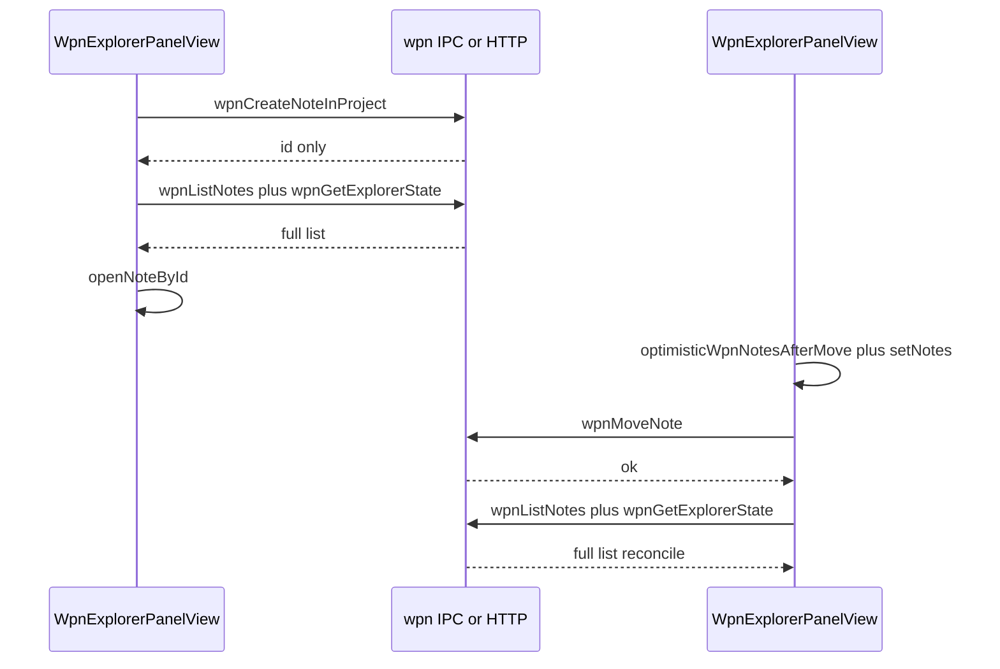

# WPN Notes explorer — UX spec (single document)

**How to use:** Attach this file or paste sections into a Cursor chat or Agent task. Implement in the Nodex repo; scope changes to the WPN explorer, shared title draft plumbing, and closely related shell/Redux if needed.

**Primary file:** [`src/renderer/shell/first-party/plugins/notes-explorer/WpnExplorerPanelView.tsx`](../src/renderer/shell/first-party/plugins/notes-explorer/WpnExplorerPanelView.tsx)

---

## Related files

- [`src/renderer/components/NoteViewer.tsx`](../src/renderer/components/NoteViewer.tsx) — `contentEditable` title, commit on blur
- [`src/renderer/shell/first-party/NoteEditorShellView.tsx`](../src/renderer/shell/first-party/NoteEditorShellView.tsx) — `onTitleCommit` + `renameNote` / VFS flow
- [`src/renderer/components/InlineSingleLineEditable.tsx`](../src/renderer/components/InlineSingleLineEditable.tsx) — explorer inline rename
- [`src/renderer/notes-sidebar/notes-sidebar-panel-dnd.ts`](../src/renderer/notes-sidebar/notes-sidebar-panel-dnd.ts) — `placementFromPointer`, `dropAllowedOne`
- [`src/renderer/components/WorkspaceMountHeaderSurface.tsx`](../src/renderer/components/WorkspaceMountHeaderSurface.tsx) — reference for drop-hint patterns
- [`src/renderer/store/notesSlice.ts`](../src/renderer/store/notesSlice.ts) — `renameNote.fulfilled` bumps `noteRenameEpoch`; explorer reloads tree on epoch change
- [`src/renderer/shell/first-party/plugins/notes-explorer/wpnExplorerEvents.ts`](../src/renderer/shell/first-party/plugins/notes-explorer/wpnExplorerEvents.ts) — `WPN_SYNC_REMOTE_POLL_INTERVAL_MS` (8000), `NODEX_WPN_TREE_CHANGED_EVENT`
- [`apps/nodex-sync-api/src/wpn-tree.ts`](../apps/nodex-sync-api/src/wpn-tree.ts) — `wpnComputeChildMapAfterMove` (shared ordering logic with optimistic client patch)

---

## Constraints

- Match existing patterns (React hooks, `getNodex().wpn*`, no unrelated refactors).
- Preserve VFS-dependent rename flows (`runWpnNoteTitleRenameWithVfsDependentsFlow`, `useVfsDependentTitleRenameChoice`).
- Optimistic updates must **revert** on error and use existing error UX (e.g. `alert`).
- **Expansion preservation:** On refresh/reconcile, merge or prune `expandedNoteParents` (and workspace/project expansion) so valid open folders stay open; drop ids for deleted nodes. [`loadProjectTree`](src/renderer/shell/first-party/plugins/notes-explorer/WpnExplorerPanelView.tsx) uses `mergeWpnExpandedNoteParents` when applying server `expanded_ids`.

---

## Guiding principle: visible change first

For **create, rename, reorder/move, and (where safe) refresh**:

1. **Update what the user sees immediately** — optimistic tree/workspace state, or open the new note **without** waiting for a full list refetch when possible.
2. **Persist and reconcile in the background** — `wpn*` calls and `loadProjectTree` / `loadWorkspaces` via `void` or after the frame that applied the optimistic patch.
3. **On failure** — restore the previous snapshot (same pattern as `performWpnNoteMove` today) and surface the error.
4. **VFS rename** — keep blocking **preview/confirm** modal; apply the visible committed title **after** the user confirms; avoid unnecessary full reload before the row shows the new title.
5. **Dual rename surfaces (notes)** — While editing a note title in **either** the explorer or the **main editor header**, the other control must mirror the string **on every input** (incremental), not only after commit. Requires a **shared draft** keyed by `noteId` (see [Incremental title sync](#incremental-title-sync-explorer--main-note-title-required)).

---

## Current baseline (as of this doc)

These are already implemented in `WpnExplorerPanelView` unless noted.

| Area | Status |
|------|--------|
| **Toolbar Refresh** | [`refreshExplorer`](src/renderer/shell/first-party/plugins/notes-explorer/WpnExplorerPanelView.tsx) runs `loadWorkspaces({ manageBusy: false })` and `loadProjectTree(selectedProjectId)` in parallel. |
| **Note DnD drop hints** | `wpnNoteDropHint`: top/bottom lines, “into” overlay, above/below/into label on rows. |
| **Note move optimistic UI** | [`optimisticWpnNotesAfterMove`](src/renderer/shell/first-party/plugins/notes-explorer/WpnExplorerPanelView.tsx) + `setNotes`, then `wpnMoveNote`, then `void loadProjectTree` in `finally`. |
| **Note expansion merge** | `mergeWpnExpandedNoteParents` when applying list + server `expanded_ids`. |
| **Empty-panel context menu Refresh** | Still calls **`loadWorkspaces()` only** and uses **`disabled={busy}`** — **not** aligned with toolbar `refreshExplorer` (backlog). |
| **Cross-project note DnD** | **Not supported** — `onDropOnNote` ignores drags where `projectId` differs. Moving notes across projects needs separate API + UI. |
| **Expand/chevron hit targets** | Note chevron: `w-4` + `text-[10px]` ▼/▶ (~lines 1138–1151). Workspace/project: `w-5` + `text-[10px]` (~1345–1357, ~1427–1442). **Too small for comfortable click/tap** (backlog). |

---

## Implementation backlog (checklist)

Use this as the ordered task list for agents; align each change with **visible first** where applicable.

1. **Empty-panel Refresh parity** — Context menu “Refresh” should call the same path as the toolbar (`refreshExplorer` or equivalent): workspaces **and** selected project’s note list, without relying on global `busy` alone.
2. **Note create** — After `wpnCreateNoteInProject` returns `id`: show new row (synthesized `WpnNoteListItem` if needed) and/or `openNoteById` immediately; `void loadProjectTree` to reconcile.
3. **Workspace / project create** — After API success: patch local `workspaces` / `projectsByWs` optimistically, then `void loadWorkspaces({ manageBusy: false })`; avoid blocking the whole panel with `setBusy(true)` except for true modals (e.g. folder picker).
4. **Workspace / project rename** — Update label in UI on commit, then PATCH in background; revert on error. Keep VFS rules for **note** rename unchanged.
5. **Incremental title sync (required)** — Shared per-note draft store + explorer + `NoteViewer` / shell title; clear on commit/cancel/switch note; dual-focus policy (e.g. last-focused wins). May require `InlineSingleLineEditable` to sync from external draft updates.
6. **DnD polish** — Hysteresis / snap for `placementFromPointer`; source-row highlight; optional `setDragImage`; soften post-drop reconcile so the tree does not “jump” when server matches optimistic order.
7. **Larger expand / chevron targets** — For every `[data-wpn-tree-chevron]` control (notes, workspaces, projects): increase **minimum interactive size** (e.g. ~28–32px square), use larger glyphs or an icon font, `inline-flex items-center justify-center`, adequate `min-h`/`min-w`, `aria-label` (“Expand” / “Collapse”), keep `closest("[data-wpn-tree-chevron]")` row-click exclusions working.

---

## Create: W / P / N still feels slow

| Action | Current flow | Why it hurts |
|--------|----------------|--------------|
| **Workspace** | `wpnCreateWorkspace` → `await loadWorkspaces()` | Full fan-out: every workspace + every project list. |
| **Project** | `wpnCreateProject` → `await loadWorkspaces()` | Same. |
| **Note** | `wpnCreateNoteInProject` → **`await loadProjectTree`** → open tab | Two sequential round-trips; APIs return only `{ id }` unless extended. |
| **Desktop folder workspace** | `setBusy(true)` around picker + create | Whole panel feels frozen. |

**Visible-first direction:** See backlog items 2–3.

---

## Rename: W / P / N

- **Workspace/project:** Today `wpnUpdate*` then `await loadWorkspaces()` — heavy, no optimistic label. **Target:** optimistic label + background PATCH + revert on error (backlog item 4).
- **Note:** After VFS confirm, row title patches via `setNotes`; `void loadProjectTree` still runs — consider skipping when only title changed. **Incremental typing sync** is a separate requirement ([Incremental title sync](#incremental-title-sync-explorer--main-note-title-required)).

---

## Drag-and-drop: done vs remaining

**Done:** Drop hints (lines, overlay, label); optimistic reorder via `optimisticWpnNotesAfterMove` + `wpnComputeChildMapAfterMove`.

**Remaining:** Placement jitter (25% / 50% / 25% bands in [`placementFromPointer`](src/renderer/notes-sidebar/notes-sidebar-panel-dnd.ts)); weak source-row feedback; `loadProjectTree` in `finally` can cause a second visual jump if server data differs slightly — see backlog item 6.

---

## Incremental title sync (explorer ↔ main note title) — **required**

**Surfaces**

- Explorer: `renaming` + [`InlineSingleLineEditable`](src/renderer/components/InlineSingleLineEditable.tsx) on note rows.
- Main: [`NoteViewer`](src/renderer/components/NoteViewer.tsx) title + [`NoteEditorShellView`](src/renderer/shell/first-party/NoteEditorShellView.tsx).

**Problem:** Two independent edit buffers; the other UI updates only after commit / Redux.

**Target:** Shared store (e.g. `noteTitleDraftById` in Redux or shell context). On input from either side: `setNoteTitleDraft({ id, text })`. Display: use draft when present for that `noteId`, else committed title. Clear draft on successful commit, cancel, or when switching notes/tabs.

**Implementation options (prefer A):**

| Option | Description |
|--------|-------------|
| **A. Shared draft store** | Recommended — maintainable, testable. |
| **B. Custom events** | Possible but easier to desync. |
| **C. Single edit surface** | Not acceptable per product ask. |
| **D. Debounced server sync** | Conflicts with VFS; not recommended. |

**Caveat:** `InlineSingleLineEditable` may need controlled sync beyond mount-only `useLayoutEffect` so editor-driven draft updates refresh the explorer field.

---

## Expand / collapse: larger hit area (chevrons)

**Problem:** The ▼/▶ controls use small width and `text-[10px]`; the clickable region is hard to hit with mouse or touch.

**Location:** [`WpnExplorerPanelView.tsx`](../src/renderer/shell/first-party/plugins/notes-explorer/WpnExplorerPanelView.tsx) — search `data-wpn-tree-chevron` (note rows ~1138–1151, workspace ~1345–1357, project ~1427–1442).

**Target:** Touch-friendly targets (commonly **44×44px** minimum on mobile; at least **~28–32px** on desktop for consistency), centered icon, visible focus ring, `aria-expanded`, accessible name.

---

## Refresh: toolbar vs menu vs expansion

**Toolbar** already refreshes workspaces + open project tree in parallel without `manageBusy` on that path.

**Gaps:** Empty-panel context menu Refresh (see backlog item 1). If any path still clobbers expansion without merge/prune, align with `mergeWpnExpandedNoteParents` behavior.

---

## Sequence: create and move (reference)

**Target shape for “visible first” (create):** After `id` returns, update UI and/or open tab **before** awaiting full `loadProjectTree`.

---

## Acceptance criteria

- **Visible first:** Create/rename/move show updated UI immediately where safe; background reconcile; revert + error on failure.
- **Refresh:** With a project selected, toolbar refresh loads workspaces and that project’s notes; expansion preserved per merge/prune rules; empty-panel refresh matches toolbar behavior.
- **DnD:** Clear before/after/into feedback; optimistic order; minimal post-drop jump; same-project only unless cross-project is explicitly built.
- **Title sync:** Typing in explorer inline title or editor header updates the other **incrementally**; dual-focus behavior documented and stable.
- **Chevrons:** Expand/collapse controls are easy to hit (adequate size, a11y labels, focus visible).
- **VFS:** Note rename still respects dependent-link preview/confirm; no silent server rename while user is in the VFS dialog.

---

## Out of scope (unless requested)

- Changing `WPN_SYNC_REMOTE_POLL_INTERVAL_MS` or sync protocol.
- Full tree virtualization unless profiling proves necessary.
- Cross-project note move (needs product + API design).
